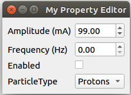

============
Introduction
============

A widget that shows the fields of a device/property, similar to the Knob
of a WorkingSet.

Widget lays things out in a form, with labels and widgets, each corresponding to the
data type of the field

