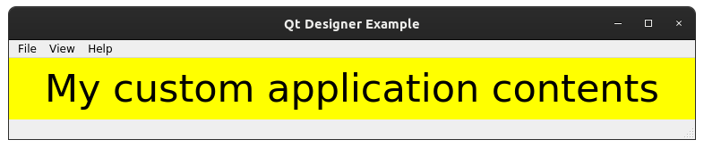
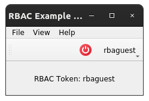
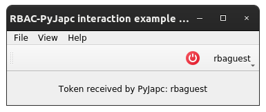
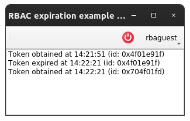
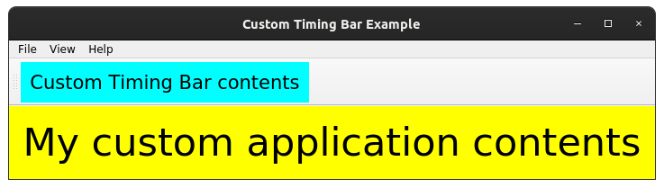
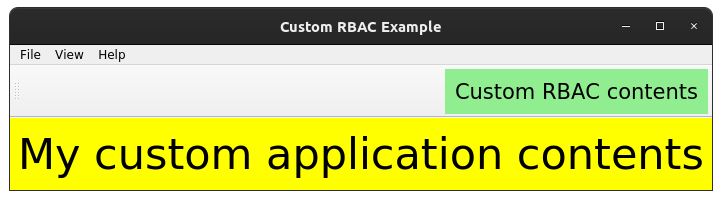
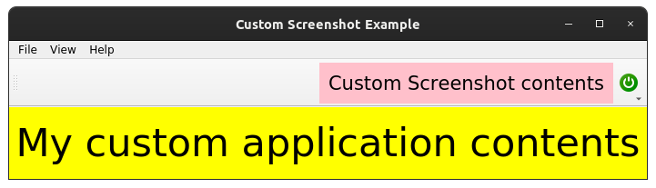

Examples
==========

This page briefly explains the examples, that can be found in ``examples/app_frame`` directory of the project's
`source code <https://gitlab.cern.ch/acc-co/accsoft/gui/accsoft-gui-pyqt-widgets>`__. To ensure presence of additional
packages needed to run examples, it is advised to install a special ``examples`` category:

.. code-block:: bash

   pip install .[examples]

- `Basic example`_
- `Qt Designer example`_
- `LogConsole example`_
- `TimingBar example`_
- `RBAC example`_
- `Subclassing example`_
- `PyJapc RBAC authentication example`_
- `RBAC expiration example`_
- `Custom log console example`_
- `Custom timing bar example`_
- `Custom RBAC example`_
- `Custom screenshot button example`_

Basic example
--------------

To launch this example from the project root, run:

.. code-block:: bash

   python examples/app_frame/programmatic_example.py

This example shows the simplest and the most minimalistic use of :class:`~accwidgets.app_frame.ApplicationFrame`
window with the default setup in code. By default, it will not enable any
additional widgets in order to prevent the implicit need to install additional dependencies for other widgets.
It is possible, however, to enable those in property configuration or via initializer arguments (see examples below).
Menus here are configured to partially recreate the experience provided by "CERN Application Frame"
:ref:`Qt Designer template <install:Enable Qt Designer templates>`.

.. container:: collapsible-block

   .. container:: collapsible-title

      .. raw:: html

         Show contents of programmatic_example.py...

   .. literalinclude:: ../../../examples/app_frame/programmatic_example.py

.. raw:: html

   

Qt Designer example
-------------------

To launch this example from the project root, run:

.. code-block:: bash

   python examples/app_frame/designer_example.py

This is the the same :class:`~accwidgets.app_frame.ApplicationFrame` example as ``programmatic_example.py``, but
integrating with Qt Designer widget, instead of the programmatically created one. By default, it will not enable any
additional widgets in order to prevent the implicit need to install additional dependencies for other widgets.
It is possible, however, to enable those in property configuration (see examples below). The ``app.ui`` file was
created using "CERN Application Frame" :ref:`Qt Designer template <install:Enable Qt Designer templates>`.

.. container:: collapsible-block

   .. container:: collapsible-title

      .. raw:: html

         Show contents of designer_example.py...

   .. literalinclude:: ../../../examples/app_frame/designer_example.py

.. raw:: html

   

LogConsole example
------------------

To launch this example from the project root, run:

.. code-block:: bash

   python examples/app_frame/log_console_example.py

This example shows the use of :class:`~accwidgets.app_frame.ApplicationFrame` window with
:class:`~accwidgets.log_console.LogConsole` enabled. Note, this code requires
additional dependencies for :class:`~accwidgets.log_console.LogConsole` must be installed, as explained in
:ref:`widgets/app_frame/index:Transitive dependencies`. Menus here are configured to partially recreate the experience
provided by "CERN Application Frame" :ref:`Qt Designer template <install:Enable Qt Designer templates>`.

.. container:: collapsible-block

   .. container:: collapsible-title

      .. raw:: html

         Show contents of log_console_example.py...

   .. literalinclude:: ../../../examples/app_frame/log_console_example.py

.. raw:: html

   

TimingBar example
-----------------

To launch this example from the project root, run:

.. code-block:: bash

   python examples/app_frame/timing_bar_example.py

This example shows the use of :class:`~accwidgets.app_frame.ApplicationFrame` window with
:class:`~accwidgets.timing_bar.TimingBar` enabled. Note, this code requires
additional dependencies for :class:`~accwidgets.timing_bar.TimingBar` must be installed, as explained in
:ref:`widgets/app_frame/index:Transitive dependencies`. For the sake of example, we are using custom model that
does not require connection to real devices (same model as used in examples of
:doc:`TimingBar itself <../timing_bar/examples>`). Timing domain can be configured on the model of the
:class:`~accwidgets.timing_bar.TimingBar` widget. Menus here are configured to partially recreate the experience
provided by "CERN Application Frame" :ref:`Qt Designer template <install:Enable Qt Designer templates>`.

.. container:: collapsible-block

   .. container:: collapsible-title

      .. raw:: html

         Show contents of timing_bar_example.py...

   .. literalinclude:: ../../../examples/app_frame/timing_bar_example.py

.. raw:: html

   

RBAC example
------------

To launch this example from the project root, run:

.. code-block:: bash

   python examples/app_frame/rbac_example.py

This example shows the use of :class:`~accwidgets.app_frame.ApplicationFrame` window with
:class:`~accwidgets.rbac.RbaButton` enabled. Note, this code requires
additional dependencies for :class:`~accwidgets.rbac.RbaButton` must be installed, as explained in
:ref:`widgets/app_frame/index:Transitive dependencies`. To present the usage of the token
in the application, the username is printed in the central widget's area. Menus here are configured to partially
recreate the experience provided by "CERN Application Frame"
:ref:`Qt Designer template <install:Enable Qt Designer templates>`.

.. container:: collapsible-block

   .. container:: collapsible-title

      .. raw:: html

         Show contents of rbac_example.py...

   .. literalinclude:: ../../../examples/app_frame/rbac_example.py

.. raw:: html

   

Subclassing example
-------------------

To launch this example from the project root, run:

.. code-block:: bash

   python examples/app_frame/subclassing_example.py

This example shows the subclassing of the :class:`~accwidgets.app_frame.ApplicationFrame` class. In this example,
subclass forces the usage of :class:`~accwidgets.timing_bar.TimingBar` widget, that is disabled in
:class:`~accwidgets.app_frame.ApplicationFrame` by default. For the sake of example, we are using custom model that
does not require connection to real devices (same model as used in examples of
:doc:`TimingBar itself <../timing_bar/examples>`). For the sake of simplicity, default timing domain is used. Menus
here are configured to partially recreate the experience provided by "CERN Application Frame"
:ref:`Qt Designer template <install:Enable Qt Designer templates>`.

.. container:: collapsible-block

   .. container:: collapsible-title

      .. raw:: html

         Show contents of subclassing_example.py...

   .. literalinclude:: ../../../examples/app_frame/subclassing_example.py

.. raw:: html

   

PyJapc RBAC authentication example
----------------------------------

To launch this example from the project root, run:

.. code-block:: bash

   python examples/app_frame/pyjapc_rbac_example.py

This example shows the use of :class:`~accwidgets.app_frame.ApplicationFrame` window with
:class:`~accwidgets.rbac.RbaButton` enabled. Note, this code requires
additional dependencies for :class:`~accwidgets.rbac.RbaButton` must be installed, as explained in
:ref:`widgets/app_frame/index:Transitive dependencies`. It is similar to the use-case in
`RBAC example`_, except the token is used to authenticate Java client inside :class:`~pyjapc.PyJapc`
(to further perform authorized interaction with the control system via :class:`~pyjapc.PyJapc`). To present the
usage of the token in :class:`~pyjapc.PyJapc`, the username that is extracted from Java RBAC token is printed in
the central widget's area. Menus here are configured to partially recreate the
experience provided by "CERN Application Frame" :ref:`Qt Designer template <install:Enable Qt Designer templates>`.

.. container:: collapsible-block

   .. container:: collapsible-title

      .. raw:: html

         Show contents of pyjapc_rbac_example.py...

   .. literalinclude:: ../../../examples/app_frame/pyjapc_rbac_example.py

.. raw:: html

   

RBAC expiration example
-----------------------

To launch this example from the project root, run:

.. code-block:: bash

   python examples/app_frame/rbac_expiration_example.py

This example shows the use of :class:`~accwidgets.app_frame.ApplicationFrame` window with
:class:`~accwidgets.rbac.RbaButton` enabled. Note, this code requires
additional dependencies for :class:`~accwidgets.rbac.RbaButton` must be installed, as explained in
:ref:`widgets/app_frame/index:Transitive dependencies`. This example presents the
events of token creation/expiration and removal. For this reason, the token lifetime is forced to 1 minute
(the shortest possible time). When logged in without selecting roles to preserve auto-renewal, after
approximately 30 seconds the list should print events about token expiration and renewal.

.. container:: collapsible-block

   .. container:: collapsible-title

      .. raw:: html

         Show contents of rbac_expiration_example.py...

   .. literalinclude:: ../../../examples/app_frame/rbac_expiration_example.py

.. raw:: html

   

Custom log console example
--------------------------

To launch this example from the project root, run:

.. code-block:: bash

   python examples/app_frame/custom_log_console_example.py

This example shows that :class:`~accwidgets.app_frame.ApplicationFrame` may accept any widget as a log console, not
necessarily derivative of accwidgets' :class:`~accwidgets.log_console.LogConsole`. If a given widget is not a
derivative of :class:`QDockWidget`, it will be automatically wrapped into one. Menus here are configured to partially
recreate the experience provided by "CERN Application Frame"
:ref:`Qt Designer template <install:Enable Qt Designer templates>`.

.. container:: collapsible-block

   .. container:: collapsible-title

      .. raw:: html

         Show contents of custom_log_console_example.py...

   .. literalinclude:: ../../../examples/app_frame/custom_log_console_example.py

.. raw:: html

   

Custom timing bar example
-------------------------

To launch this example from the project root, run:

.. code-block:: bash

   python examples/app_frame/custom_timing_bar_example.py

This example shows that :class:`~accwidgets.app_frame.ApplicationFrame` may accept any widget as a timing bar, not
necessarily derivative of accwidgets' :class:`~accwidgets.timing_bar.TimingBar`. Menus here are configured to
partially recreate the experience provided by "CERN Application Frame"
:ref:`Qt Designer template <install:Enable Qt Designer templates>`.

.. container:: collapsible-block

   .. container:: collapsible-title

      .. raw:: html

         Show contents of custom_timing_bar_example.py...

   .. literalinclude:: ../../../examples/app_frame/custom_timing_bar_example.py

.. raw:: html

   

Custom RBAC example
-------------------

To launch this example from the project root, run:

.. code-block:: bash

   python examples/app_frame/custom_rbac_example.py

This example shows that :class:`~accwidgets.app_frame.ApplicationFrame` may accept any widget as a RBAC button, not
necessarily derivative of accwidgets' :class:`~accwidgets.rbac.RbaButton`. Menus here are configured to
partially recreate the experience provided by "CERN Application Frame"
:ref:`Qt Designer template <install:Enable Qt Designer templates>`.

.. container:: collapsible-block

   .. container:: collapsible-title

      .. raw:: html

         Show contents of custom_rbac_example.py...

   .. literalinclude:: ../../../examples/app_frame/custom_rbac_example.py

.. raw:: html

   

Custom screenshot button example
--------------------------------

To launch this example from the project root, run:

.. code-block:: bash

   python examples/app_frame/custom_screenshot_example.py

This example shows that :class:`~accwidgets.app_frame.ApplicationFrame` may accept any widget as a Screenshot button,
not necessarily derivative of accwidgets' :class:`~accwidgets.screenshot.ScreenshotButton`. If the provided widget
does not provide hooks to automatically connect to :class:`~accwidgets.rbac.RbaButton`, the RBAC token propagation
won't be created automatically and it's up to the developer to ensure it. Menus here are configured to partially
recreate the experience provided by "CERN Application Frame"
:ref:`Qt Designer template <install:Enable Qt Designer templates>`.

.. container:: collapsible-block

   .. container:: collapsible-title

      .. raw:: html

         Show contents of custom_screenshot_example.py...

   .. literalinclude:: ../../../examples/app_frame/custom_screenshot_example.py

.. raw:: html

   

