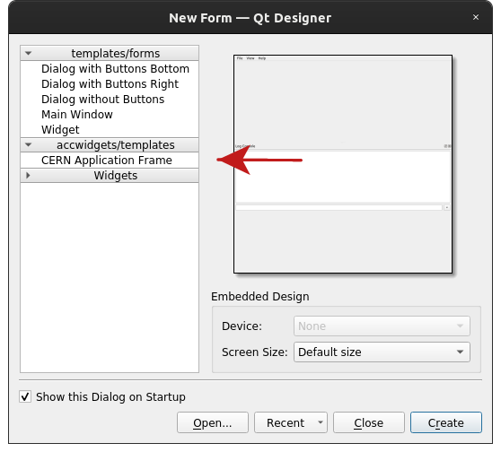
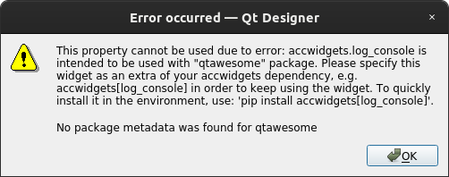
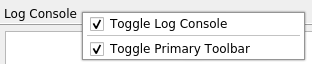

ApplicationFrame
================

.. note:: To start using this widget, make sure to specify ``app_frame`` as an extra, when installing
          accwidgets, or use ``all-widgets``. More on :ref:`install:Specifying dependencies`. In addition,
          you may need to specify ``log_console``, ``rbac`` or ``timing_bar``, when these components are enabled,
          as stated in `Transitive dependencies`_.

- `Transitive dependencies`_
- `Using in Qt Designer`_
- `Primary toolbar`_
- `Toggle view actions`_
- `About dialog`_
- `Further read`_

:class:`~accwidgets.app_frame.ApplicationFrame` provides a standard window for PyQt accelerator applications.

.. image:: ../../img/appframe.png

The window integrates with common components often used in accelerator applications, such as
:class:`~accwidgets.log_console.LogConsoleDock` or :class:`~accwidgets.timing_bar.TimingBar`. Each component can be
enabled or removed depending on the needs, and components are individually configurable according
to their own API.

Transitive dependencies
-----------------------

Certain components may have extra dependencies in addition to those declared by
:class:`~accwidgets.app_frame.ApplicationFrame`. When enabling these components, make sure to use the specifier for
the given widgets when specifying dependencies of your project (see :ref:`install:Specifying dependencies`). For
instance, :class:`~accwidgets.timing_bar.TimingBar` will have a requirement for certain
:ref:`widgets/timing_bar/index:PyJapc` versions.

.. note:: Application developer must specify dependency on used components for his or her application,
          in addition to ``app_frame`` extra for the :class:`~accwidgets.app_frame.ApplicationFrame` (or use
          ``all-widgets`` extra). See :ref:`install:Specifying dependencies`.

Using in Qt Designer
--------------------

When it comes to Qt Designer, :class:`~accwidgets.app_frame.ApplicationFrame` appears to be more special than other
widgets. It is due to the fact that widgets placed in a "Widget Box" are supposed to be dragged onto the already
existing form. But in this case, :class:`~accwidgets.app_frame.ApplicationFrame` is the form itself, since it acts as
a replacement for :class:`QMainWindow`.

To benefit from :class:`~accwidgets.app_frame.ApplicationFrame` in Qt Designer, one must create a new file, using
"CERN Application Frame" template in the "New Form" dialog, instead of traditional "Widget" or "Main Window" templates.

   Start a Qt Designer project with "CERN Application Frame" template

To enable this template, see :ref:`install:Enable Qt Designer templates`.

The resulting form not only uses :class:`~accwidgets.app_frame.ApplicationFrame` that is reconfigurable via
"Property Editor", it also sets up menus and signals/slots to look like a complete application (e.g.
maximize/minimize/fullscreen menu items, "File"→"Exit" and "Help"→"About"). These presets can be removed at will.

:class:`~accwidgets.app_frame.ApplicationFrame` cannot be found in the "Widget Box" (again, because it should not be
dragged onto another window), but still is loaded by Qt Designer and can be seen in "Help"→"About Plugins" list.

:class:`~accwidgets.app_frame.ApplicationFrame`'s subcomponents, such as :class:`~accwidgets.timing_bar.TimingBar`
or :class:`~accwidgets.log_console.LogConsole`, can be enabled in "Property Editor". If a subcomponent is missing
dependencies (see `Transitive dependencies`_), an error will be shown in the popup and the subcomponent will not be
enabled.

   Example of ApplicationFrame's subcomponent missing dependencies

Primary toolbar
---------------

Standard :class:`QMainWindow` can accommodate multiple :class:`QToolBar` panels. However, for
:class:`~accwidgets.app_frame.ApplicationFrame` to know where to place its additional components it introduces the
notion of "Primary toolbar". It distinguishes primary toolbar from the rest by its window title. If it does not exist,
:class:`~accwidgets.app_frame.ApplicationFrame` will create one when it has a need to accommodate a component in a
toolbar. Programmatically, this toolbar can be accessed via :meth:`~accwidgets.app_frame.ApplicationFrame.main_toolbar`
method. By default, toolbars may be rearranged and dragged around by the user, but as long as the title condition is
respected, :class:`~accwidgets.app_frame.ApplicationFrame` will always use the correct toolbar for its components.

.. note:: Primary toolbar gets automatically removed when all of :class:`~accwidgets.app_frame.ApplicationFrame`'s
          relevant components are removed. Attention should be payed when placing custom actions/widgets into this
          toolbar. Developer has to make sure that :class:`~accwidgets.app_frame.ApplicationFrame`'s components
          are not being removed at any point, to not cause the removal of the toolbar. Alternatively, it is possible to
          create another toolbar for custom widgets/actions. 2 separate toolbars can be perfectly co-exist side by side
          in a horizontal or a vertical ribbon.

Toggle view actions
-------------------

Each of :class:`~accwidgets.app_frame.ApplicationFrame`'s components can be shown or hidden by the user via toggle view
actions. These actions are available when right-clicking on the :class:`~accwidgets.log_console.LogConsoleDock`'s title
area, or over a toolbar. In addition, if top level menu "View" exists, :class:`~accwidgets.app_frame.ApplicationFrame`
will place the toggle view actions in that menu.

   Toggle view actions

About dialog
------------

To create a standard structure for applications, :class:`~accwidgets.app_frame.ApplicationFrame` also ships with a
simple "About" dialog, that can be shown via :meth:`~accwidgets.app_frame.ApplicationFrame.showAboutDialog` slot. This
slot is connected by "CERN Application Frame" template (see `Using in Qt Designer`_). This slot can also be overridden
to create a custom "About" dialog instance. Window icon is used to display a logo in the standard "About" dialog, and
:attr:`~accwidgets.app_frame.ApplicationFrame.appVersion` property is used to display the application version. This
property exists purely for information purposes and does not influence anything else.

Further read
------------

.. toctree::
   :maxdepth: 1

   examples
   api
