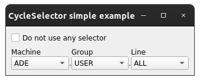
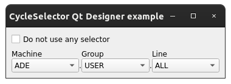
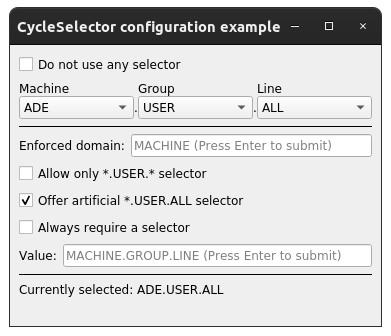
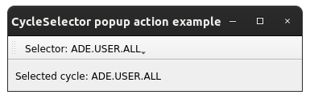
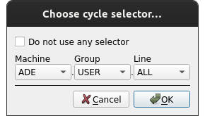
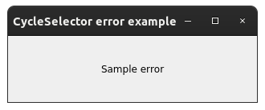
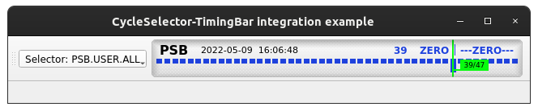

Examples
==========

This page briefly explains the examples, that can be found in ``examples/cycle_selector`` directory of the project's
`source code <https://gitlab.cern.ch/acc-co/accsoft/gui/accsoft-gui-pyqt-widgets>`__. To ensure presence of additional
packages needed to run examples, it is advised to install a special ``examples`` category:

.. code-block:: bash

   pip install .[examples]

- `Basic example`_
- `Qt Designer example`_
- `Properties example`_
- `Action example`_
- `Dialog example`_
- `Error example`_
- `TimingBar integration example`_

Basic example
-------------

To launch this example from the project root, run:

.. code-block:: bash

   python examples/cycle_selector/basic_example.py

This example shows the simplest way of using :class:`~accwidgets.cycle_selector.CycleSelector` widget. Whenever
selector is updated, it will be printed to the console.

.. container:: collapsible-block

   .. container:: collapsible-title

      .. raw:: html

         Show contents of basic_example.py...

   .. literalinclude:: ../../../examples/cycle_selector/basic_example.py

.. raw:: html

   

Qt Designer example
-------------------

To launch this example from the project root, run:

.. code-block:: bash

   python examples/cycle_selector/designer_example.py

This is the same example as `Basic example`_, but integrating with Qt Designer widget, instead of the
programmatically created one. The newly chosen cycle selector is printed to the console. Because Qt Designer does
not allow placing widgets into toolbars, only :class:`~accwidgets.cycle_selector.CycleSelector` is available there,
while :class:`~accwidgets.cycle_selector.CycleSelectorAction` and
:class:`~accwidgets.cycle_selector.CycleSelectorDialog` are left for the programmatic use.

.. container:: collapsible-block

   .. container:: collapsible-title

      .. raw:: html

         Show contents of designer_example.py...

   .. literalinclude:: ../../../examples/cycle_selector/designer_example.py

.. raw:: html

   

Properties example
------------------

To launch this example from the project root, run:

.. code-block:: bash

   python examples/cycle_selector/props_example.py

This is a more complex example that lets you configure the :class:`~accwidgets.cycle_selector.CycleSelector` widget
via UI, and experience its behavior and errors, given certain constraints. For instance,
:attr:`~accwidgets.cycle_selector.CycleSelector.requireSelector` will raise an error if no selector is provided.
Similarly, :attr:`~accwidgets.cycle_selector.CycleSelector.enforcedDomain` will make sure that a selector for the
specific machine is given.

.. container:: collapsible-block

   .. container:: collapsible-title

      .. raw:: html

         Show contents of props_example.py...

   .. literalinclude:: ../../../examples/cycle_selector/props_example.py

.. raw:: html

   

Action example
--------------

To launch this example from the project root, run:

.. code-block:: bash

   python examples/cycle_selector/action_example.py

This example shows the simplest way of using :class:`~accwidgets.cycle_selector.CycleSelectorAction` for integrating
into user-defined button. Not in this example, but the same action can be integrated into a :class:`QMenu` menu.
Whenever selector is updated, it will appear in the label inside the window.
:class:`~accwidgets.cycle_selector.CycleSelectorAction` provides a wrapper that displays the
:class:`~accwidgets.cycle_selector.CycleSelector` widget in a popup.

.. container:: collapsible-block

   .. container:: collapsible-title

      .. raw:: html

         Show contents of action_example.py...

   .. literalinclude:: ../../../examples/cycle_selector/action_example.py

.. raw:: html

   

Dialog example
--------------

To launch this example from the project root, run:

.. code-block:: bash

   python examples/cycle_selector/dialog_example.py

This example shows the way of using :class:`~accwidgets.cycle_selector.CycleSelectorDialog`, which wraps
:class:`~accwidgets.cycle_selector.CycleSelectorWidget` in a simple dialog with "Ok" and "Cancel" buttons.
When the dialog selection is finished, the new value will be printed to the console, unless the dialog has been
cancelled.

.. container:: collapsible-block

   .. container:: collapsible-title

      .. raw:: html

         Show contents of dialog_example.py...

   .. literalinclude:: ../../../examples/cycle_selector/dialog_example.py

.. raw:: html

   

Error example
-------------

To launch this example from the project root, run:

.. code-block:: bash

   python examples/cycle_selector/error_example.py

This is the example of how communication error is displayed to the user. Since the widget communicates with
:mod:`CCDA <pyccda>`, a communication error may happen. In that case, the error message will be displayed in
place of widget UI controls.

.. container:: collapsible-block

   .. container:: collapsible-title

      .. raw:: html

         Show contents of error_example.py...

   .. literalinclude:: ../../../examples/cycle_selector/error_example.py

.. raw:: html

   

TimingBar integration example
-----------------------------

To launch this example from the project root, run:

.. code-block:: bash

   python examples/cycle_selector/timing_bar_example.py

This example shows how a cycle selector (via :class:`~accwidgets.cycle_selector.CycleSelectorAction`) could be
integrated with the :class:`~accwidgets.timing_bar.TimingBar`. Choosing a specific selector, will reconfigure
:class:`~accwidgets.timing_bar.TimingBar` to display the timing of the respective timing domain.

.. container:: collapsible-block

   .. container:: collapsible-title

      .. raw:: html

         Show contents of timing_bar_example.py...

   .. literalinclude:: ../../../examples/cycle_selector/timing_bar_example.py

.. raw:: html

   

