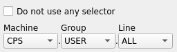

.. rst_epilog sometimes fails, so we need to include this explicitly, for colors
.. include:: <s5defs.txt>
.. include:: ../../extra-s5defs.txt

Cycle selector
==============

.. note:: To start using this widget, make sure to specify ``cycle_selector`` as an extra, when installing
          accwidgets, or use ``all-widgets``. More on :ref:`install:Specifying dependencies`.

This component allows discovering available selectors (i.e. timing users) from CCDB. It is possible to embed the
widget directly or use an auxiliary :class:`QDialog` or :class:`QAction` that render the widget in a respective manner.

- `Configuration`_
- `Helper widgets`_
- `Errors`_
- `Asynchronous operation`_
- `Alternative CCDB environments`_
- `Further read`_

This widget is meant to be equally useful for generic applications that can encounter any type of cycle selector,
as well as accelerator-specific application that work with the certain timing domain.

Configuration
-------------

Widget configuration allows narrowing down options available to the user:

* :attr:`~accwidgets.cycle_selector.CycleSelector.requireSelector` makes the non-empty selector value essential. In
  this mode, the checkbox to omit the value is removed.

* :attr:`~accwidgets.cycle_selector.CycleSelector.enforcedDomain` limits the possible selection to the single machine
  or timing domain. In this mode, the "Machine" combobox is disabled and is set to this specific value.

* :attr:`~accwidgets.cycle_selector.CycleSelector.onlyUsers` permits only timing users of format ``*.USER.*``. All
  other group values will be removed from the combobox and it gets disabled.

* :attr:`~accwidgets.cycle_selector.CycleSelector.allowAllUser` renders an artificial line called ``ALL``,
  enabling selectors such as ``PSB.USER.ALL``. While not a real selector from the hardware perspective, this option
  allows all destinations of the current machine to be selected.

Setting any of these configuration options may contradict with existing
:attr:`~accwidgets.cycle_selector.CycleSelector.value`. If conflict is discovered, the error will be thrown.

.. seealso:: :ref:`widgets/cycle_selector/examples:Properties example`

Helper widgets
--------------

While :class:`~accwidgets.cycle_selector.CycleSelector` allows embedding the selector UI anywhere, few convenience
widgets are available:

* :class:`~accwidgets.cycle_selector.CycleSelectorDialog` provides a :class:`QDialog`-derivative that is useful for
  presenting the selector in a dialog UI with "Ok" and "Cancel" button available out of the box.

  .. seealso:: :ref:`widgets/cycle_selector/examples:Dialog example`

* :class:`~accwidgets.cycle_selector.CycleSelectorAction` provides a :class:`QAction`-derivative that can be plugged
  into a :class:`QMenu` or :class:`QToolButton`. This way, it is possible to visualize the selector UI in a popup.

  .. seealso:: :ref:`widgets/cycle_selector/examples:Action example`

Errors
------

Because the widget is relying on connection to CCDB, it is susceptible to connection problems. When the network request
error happens, the widget UI will be replaced by the error message.

   Connection error in the cycle selector

.. seealso:: :ref:`widgets/cycle_selector/examples:Error example`

If there's a need to update the widget without having to recreate it (e.g. if network connection has been restored),
call :meth:`~accwidgets.cycle_selector.CycleSelector.refetch`.

Asynchronous operation
----------------------

Similar to other potentially long-lasting requests to CCDB, such as in :doc:`../parameter_selector/index`, the
request here is made in an asynchronous way in order to not block the UI.

   UI stub, while CCDB request is performed asynchronously

If the widget is hidden, either by closing the :class:`~accwidgets.cycle_selector.CycleSelectorDialog` or otherwise,
the active request to CCDB will be aborted.

Alternative CCDB environments
-----------------------------

.. include:: ../_pyccda_config.rst

Further read
------------

.. toctree::
   :maxdepth: 1

   examples
   api/modules
