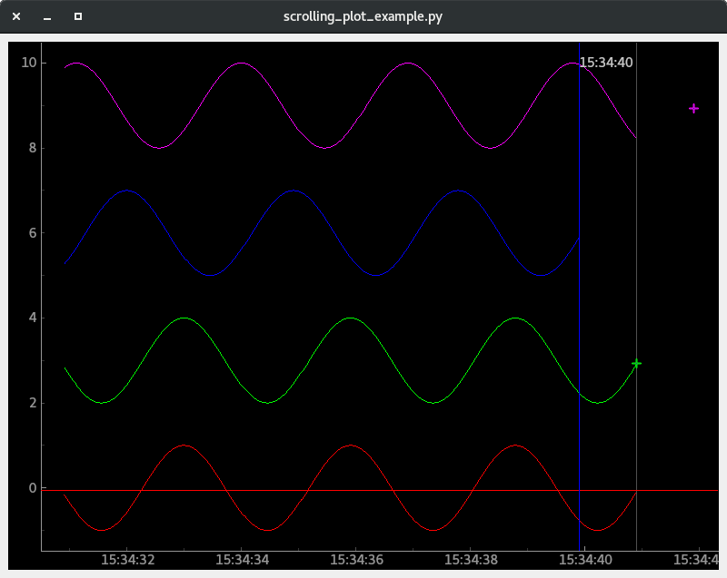
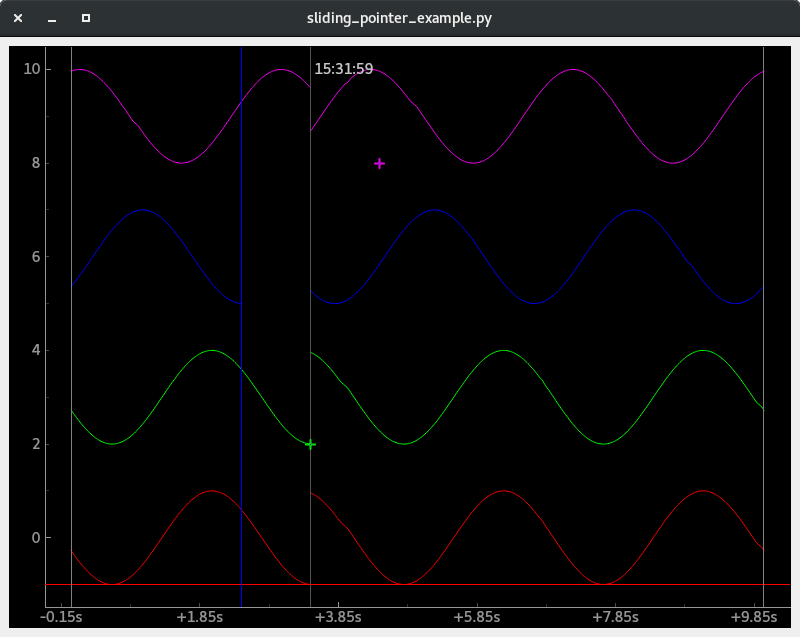
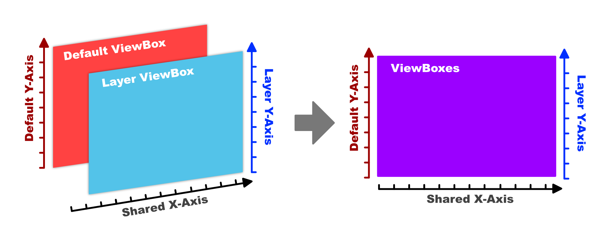
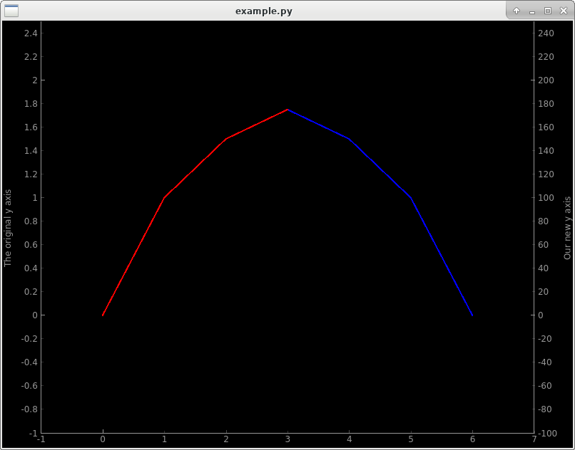

Concepts in detail
====================================

- `Plotting Styles`_
- `Data Model and Update Source`_

  * `Data Model`_
  * :ref:`Update Source General`

- `Multiple Y-Axes and Layers`_

  * `The problem`_
  * `Layer concept`_
  * `Configuration of Layers`_

- `Architecture`_
- `Other useful additions`_

  * `API usability improvements`_

Plotting Styles
---------------

As mentioned in the :ref:`widgets/graphs/index:Features`, data can be visualized not only as different elements (Curves, Bar Graphs, etc...)
but also in different plotting styles, affecting how live data is integrated.

==============  ==================================================================  ============================================================================
Plotting Style  Plot Widget Class                                                   Features
--------------  ------------------------------------------------------------------  ----------------------------------------------------------------------------
STATIC          :class:`~accwidgets.graph.widgets.plotwidget.StaticPlotWidget`      - New data completely replaces existing data
                                                                                    - Best option for plotting static data with pure PyQtGraph plotting items
                                                                                      (:class:`pyqtgraph.PlotDataItem`, :class:`pyqtgraph.BarGraphItem`, etc.)
SCROLLING       :class:`~accwidgets.graph.widgets.plotwidget.ScrollingPlotWidget`   New data is appended on the right. The plot will scroll
                                                                                    automatically, so the new data moves into the view. Data that is older than
                                                                                    the visible range, won't be displayed anymore.
CYCLIC          :class:`~accwidgets.graph.widgets.plotwidget.CyclicPlotWidget`      At first, new data is appended on the right. When the new data reaches the
                                                                                    end of the configured cycle, it starts to overwrite the old data, moving
                                                                                    left to right.
EDITABLE        - :class:`~accwidgets.graph.widgets.plotwidget.EditablePlotWidget`  - Edit individual points in a curve using plots
                - :class:`~accwidgets.graph.widgets.editingbar.EditingToolBar`      - Apply predefined or custom functions on multiple points on a plot
==============  ==================================================================  ============================================================================

   Scrolling Plot example

   Cyclic Plot example

A plot widget cannot change its supported plotting style dynamically. All items added through the widget's convenience
methods (e.g. :meth:`~accwidgets.graph.widgets.plotwidget.ExPlotWidget.addCurve`) will automatically fit this style.
If a plotting style does not support a certain
type of data visualization, a :exc:`TypeError` will be raised. If items are created manually and added using widget's
:meth:`~accwidgets.graph.widgets.plotitem.ExPlotItem.addItem` method, the user has to make sure that they are
fitting the widget's plotting style.

Data Model and Update Source
----------------------------

PyQtGraph does not decouple item's representation from the data. Our Graph introdces a data model for all items
that base from standard PyQtGraph's plotting items.

Data Model
^^^^^^^^^^

Each view (e.g. a live plotted curve) has its own data model, which is created when initializing the view. The model
is responsible for:

#. Storing data
#. Notifying the view about updates via PyQt signals

Each view provides the default data model, instantiated automatically.

.. _Update Source General:

Update Source
*************

Data models are decoupled from the acquisition of data, which is handled by the
:class:`~accwidgets.graph.datamodel.connection.UpdateSource`. This enables reusing of the data model,
regardless if data comes from a locally simulated source or from a control system device.
Each :class:`~accwidgets.graph.datamodel.connection.UpdateSource` is responsible for:

#. Acquiring data
#. Wrapping data in a data structure, which can be interpreted by the data model
#. Publishing this data structure via a PyQt signal

In contrast to the data model, which is created automatically, user is required to provide an explicit
:class:`~accwidgets.graph.datamodel.connection.UpdateSource`.

One way to do that is implementing
:class:`~accwidgets.graph.datamodel.connection.UpdateSource` subclass and utilizing PyQt signals for publishing the data:

.. code-block:: python
   :linenos:

   import datetime
   from accwidgets import graph as accgraph

   class ZeroSource(accgraph.UpdateSource):

       def __init__(self):
           self.timer = QTimer(self)
           self.timer.timeout.connect(self._emit)
           self.timer.start(1000 / 60)

       def _emit(self):
           now = datetime.now().timestamp()
           point = accgraph.PointData(x_value=now,
                                      y_value=0.0)
           self.sig_new_data[accgraph.PointData].emit(point)

Another option is creating an instance of :class:`~accwidgets.graph.datamodel.connection.UpdateSource` directly and
calling its signals externally:

.. code-block:: python
   :linenos:

   import datetime
   from accwidgets import graph as accgraph

   # ...
   source = accgraph.UpdateSource()
   curve = accgraph.CurveData(x_value=[0.0, 1.0, 2.0, 3.0],
                              y_value=[0.0, 1.0, 2.0, 3.0])
   source.sig_new_data[accgraph.CurveData].emit(curve)
   # ...

Multiple Y-Axes and Layers
--------------------------

The problem
^^^^^^^^^^^

Plotting against multiple y-axes in PyQtGraph does mean you are plotting in different :class:`~pyqtgraph.ViewBox`
instances. ViewBoxes are areas that display items in a coordinate system. Each :class:`~pyqtgraph.ViewBox` has a
view range that influences, where how coordinates are mapped to the screen. This :meth:`~pyqtgraph.ViewBox.viewRange`
is displayed by the :class:`~pyqtgraph.AxisItem`, which is located on of the sides of the plot.

Adding a new Y-:class:`~pyqtgraph.AxisItem` and a new :class:`~pyqtgraph.ViewBox` requires a lot of boilerplate code,
which is not simple to comprehend for newcomers. An official PyQtGraph online example looks like this:

.. code-block:: python
   :linenos:

   # Add a single axis on the right side and set its label
   self.vb_1 = pyqtgraph.ViewBox()
   self.plot.plotItem.showAxis("right")
   self.plot.plotItem.scene().addItems(self.vb_1)
   self.plot.plotItem.getAxis("right").linkToView(self.vb_1)
   self.plot.plotItem.getAxis("right").setLabel("axis_2", color="#0000ff")
   self.plot.plotItem.vb.sigResized.connect(self._update_views)

   def _update_views()
       self.vb_1.setGeometry(self.plot.plotItem.vb.sceneBoundingRect())
       self.vb_1.linkedViewChanged(self.plot.plotItem.vb, self.vb_1.XAxis)

After adding a second Y-axis, you will find that certain cases are still not handled correctly:

#. Most common APIs, such as :meth:`~pyqtgraph.ViewBox.setRange`, :meth:`~pyqtgraph.PlotItem.setLabel` or
   :meth:`~pyqtgraph.PlotItem.addItem` can't be used with the new axis, when they are called on
   :class:`~pyqtgraph.PlotWidget` and :class:`~pyqtgraph.PlotItem` instances
#. Pan and zoom will not affect the new Y-axis
#. "View All" will not affect the new Y-axis

The following video compares side by side the standard PyQtGraph with multiple Y-axes on the left, and the accwidgets
Graph with its improved handling on the right:

.. raw:: html

   <video style="width: 100%" controls src="../../_static/layer_demo_cut.webm"></video>
   

Layer concept
^^^^^^^^^^^^^

To solve the above problem, we introduced a concept called **Layers**.

- Every **Layer** is composed of an **Y-axis** and a **ViewBox**
- Each PyQtGraph widget always has an **initial ViewBox and a standard Y-axis** on the left showing the **ViewBox**'s range - this is considered our **Default Layer**
- All layers share the same X range and X-axis
- Each layer has its own unique string **identifier** that is chosen by the user at layer creation
- All plot items are added to a specific layer, or **Default Layer**, if not specified
- Interacting with an a **Y-axis** will move the view range of its **Layer's** **ViewBox**
- Interacting directly in the plot are instead of axes will affect all **ViewBoxes** at the same time
- "View All" will take items of all **Layer** into consideration

Configuration of Layers
^^^^^^^^^^^^^^^^^^^^^^^

Axis APIs have been extended to support layers. The following example showcases the new approach with additional layers:

.. code-block:: python
   :linenos:

   import sys
   from qtpy.QtWidgets import QApplication, QMainWindow
   from accwidgets import graph as accgraph
   import pyqtgraph as pg

   class MainWindow(QMainWindow):

       def __init__(self, *args, **kwargs):
           super().__init__(*args, **kwargs)
           self.show()
           self.resize(800, 600)
           # Static Plot, the x axis displays float values
           self.plot = accgraph.StaticPlotWidget(parent=self)
           self.setCentralWidget(self.plot)
           # Two Static PyQtGraph curves
           curve_1 = pg.PlotDataItem([0.0, 1.0, 2.0, 3.0], [0.0, 1.0, 1.5, 1.75], pen=pg.mkPen(color="r", width=2.0))
           curve_2 = pg.PlotDataItem([3.0, 4.0, 5.0, 6.0], [175.0, 150.0, 100.0, 0.0], pen=pg.mkPen(color="b", width=2.0))
           # Add the first curve 1 to the default layer
           self.plot.addItem(item=curve_1)
           # Add a second layer with viewbox and y-axis to the plot
           self.plot.add_layer(identifier="layer_0",)
           # Add the curve into the new layer we've created
           self.plot.addItem(item=curve_2,
                             layer="layer_0")
           # Setting the label on the left axis as in normal PyQtGraph
           self.plot.setLabel(axis="left",
                              text="The original y axis")
           # PyQtGraph functionality has been extended to work with layers, where axes are accepted as parameters
           self.plot.setLabel(axis="layer_0",
                              text="Our new y axis")
           # Layer identifier can be used as keywords in some API's that accept multiple axes
           self.plot.setRange(xRange=(-1.0, 7.0),
                              yRange=(-1.0, 2.5),
                              layer_0=(-100.0, 250.0),
                              padding=0.0)

   def run():
       app = QApplication(sys.argv)
       _ = MainWindow()
       sys.exit(app.exec_())

   if __name__ == "__main__":
       run()

Curves in the example have very different Y-ranges, but still both are perfectly visible as they have different scale
factors, thanks to their layer configuration:

   Multiple layers example

Architecture
------------

The following picture presents relation between PyQtGraph and our Graph taking curve as a representative plotting type.
There are more types that are not shown in the schematic.

.. figure:: ../../img/graph_arch.svg
   :align: center
   :alt: Graph class hierarchy

   Graph class hierarchy

You may notice the 3 tiers of Graph's architecture: widgets, data model, connection. The functional relation between
them is explained in :ref:`widgets/graphs/concepts:Data Model and Update Source`.

Other useful additions
----------------------

API usability improvements
^^^^^^^^^^^^^^^^^^^^^^^^^^

PyQtGraph's API very often (but not always) does not declare explicit function arguments. This hurts usability
without comprehensive documentation or ever requires reading PyQtGraph's code in some cases. Neither of that is
appealing to inexperienced users.

Take a look at the signature of :meth:`pyqtgraph.ViewBox.addItem`:

.. code-block:: python
   :linenos:

   # From PyQtGraph's ViewBox class:

   def addItem(self, item, *args, **kwargs):
       """
       Add a graphics item to the view box.
       If the item has plot data (PlotDataItem, PlotCurveItem, ScatterPlotItem), it may
       be included in analysis performed by the PlotItem.
       """
       self.items.append(item)
       # ...

To improve usability of such APIs, we change the signature to include explicit arguments in methods that we override in
subclasses. In addition, we add type hints and docstrings to even further improve API usage experience.

.. note:: There is no intention to duplicate complete set of PyQtGraph's APIs just to improve method signatures. We do
          that only to methods that we need to override anyway.

To avoid our explicit API breaking with newer PyQtGraph versions, we have added ``**kwargs`` to our APIs, which will
capture any new arguments, appearing in the newer PyQtGraph version before our subclass API can be improved.

Here's the same method, in our own subclass, :class:`~accwidgets.graph.widgets.plotitem.ExPlotItem`:

.. code-block:: python
   :linenos:

   # From Graph's ExPlotItem, which is overwriting the ViewBox's addItem

   # ...
   def addItem(
       self,
       item: Union[pg.GraphicsObject, DataModelBasedItem],
       layer: Optional["LayerIdentification"] = None,
       ignoreBounds: bool = False,
       **kwargs
   ):
       """
       Add an item to the plot. If no layer is provided, the item
       will be added to the default ViewBox of the PlotItem, if a layer
       is provided, the item will be added to its ViewBox.

       Args:
           item: Item that should be added to the plot
           layer: Either a reference to the layer or its identifier in which's
                  ViewBox the item should be added
           ignoreBounds: should the bounding rectangle of the item be respected
                         when auto ranging the plot
           kwargs: Additional arguments in case the original PyQtGraph API changes
       """
   # ...

