Examples
==========

This page briefly explains the examples, that can be found in ``examples/graph`` directory of the project's
`source code <https://gitlab.cern.ch/acc-co/accsoft/gui/accsoft-gui-pyqt-widgets>`__.

- `Simple example`_
- `Qt Designer example`_
- `ScrollingPlotWidget example`_
- `CyclicPlotWidget example`_
- `StaticPlotWidget example`_
- `Showcase of available data representation types`_
- `Multi Y-axis live plotting example`_
- `Multi Y-axis static plotting example`_
- `Curve fitting example`_
- `EditablePlotWidget example`_
- `Custom editable transformations example`_
- `Example of mixing historical and live data`_
- `Light background example`_
- `Custom axis ticks example`_
- `Qt Slot example`_
- `Dynamic time span example`_
- `Dynamic plotting style example`_
- `Multi-threading example`_

Simple example
--------------

To launch this example from the project root, run:

.. code-block:: bash

   python examples/graph/simple_example.py

Example that uses a :class:`~accwidgets.graph.ScrollingPlotWidget` in the standard configuration with the simulated
sinus curve data.

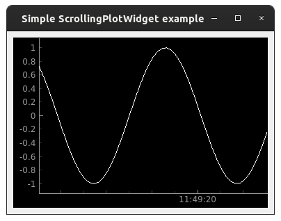

.. container:: collapsible-block

   .. container:: collapsible-title

      .. raw:: html

         Show contents of simple_example.py...

   .. literalinclude:: ../../../examples/graph/simple_example.py

.. raw:: html

   

Qt Designer example
-------------------

To launch this example from the project root, run:

.. code-block:: bash

   python examples/graph/designer_example.py

Example for creating a window from Qt Designer file featuring the :class:`~accwidgets.graph.StaticPlotWidget`,
:class:`~accwidgets.graph.ScrollingPlotWidget` and :class:`~accwidgets.graph.CyclicPlotWidget` Qt Designer plugins.
Layers and curves are not added in Qt Designer but by hand after loading the UI file.

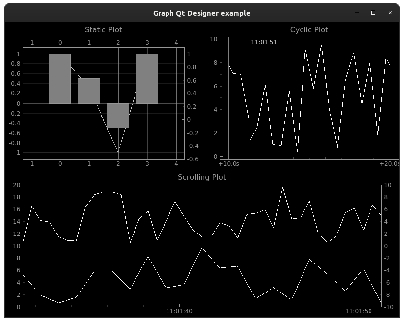

.. container:: collapsible-block

   .. container:: collapsible-title

      .. raw:: html

         Show contents of designer_example.py...

   .. literalinclude:: ../../../examples/graph/designer_example.py

.. raw:: html

   

ScrollingPlotWidget example
---------------------------

To launch this example from the project root, run:

.. code-block:: bash

   python examples/graph/scrolling_plot_example.py

Example application of a plot displaying two curves displaying continuously emitted data. As soon as new data
arrives, the new point will be inserted into the curve. As time progresses, the plot scrolls to show new data on
the right side, while moving older data outside of the view on the left side.

Additionally, the plot is attached to an extra source for timing updates, which controls the time span of data
shown by the plot. If a point with a time span newer than the current time provided by the timing source is emitted,
it won't be visible until it is revealed as soon as the timing source progresses.

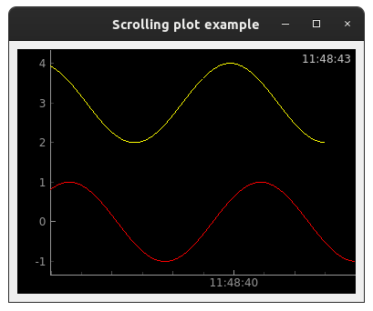

.. container:: collapsible-block

   .. container:: collapsible-title

      .. raw:: html

         Show contents of scrolling_plot_example.py...

   .. literalinclude:: ../../../examples/graph/scrolling_plot_example.py

.. raw:: html

   

CyclicPlotWidget example
------------------------

To launch this example from the project root, run:

.. code-block:: bash

   python examples/graph/cyclic_plot_example.py

Example application of a plot displaying two curves of continuously emitted data. Instead of the plot continuously
moving as new data arrives, the curves will start to redraw themselves from the beginning as soon as the curve
reaches the right border of the plot. Additionally, the plot is attached to an extra source for timing updates that
controls the time span of data shown by the plot. If points with a timestamp more recent than the configured time
span are emitted, it won't be visible until it is revealed as soon as the timing source progresses.

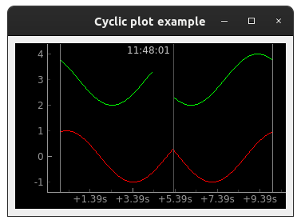

.. container:: collapsible-block

   .. container:: collapsible-title

      .. raw:: html

         Show contents of cyclic_plot_example.py...

   .. literalinclude:: ../../../examples/graph/cyclic_plot_example.py

.. raw:: html

   

StaticPlotWidget example
------------------------

To launch this example from the project root, run:

.. code-block:: bash

   python examples/graph/static_plot_example.py

Example application of a plot displaying two curves displaying continuously changing data. The two displayed
sin curves are being scaled in Y direction. As a new sinus curve is emitted, it is replacing the old one.
:class:`~accwidgets.graph.StaticPlotWidget`, in contrast with other plot widget types, replaces the entire
contents of the graph with the new data every time. Hence, it is perfect for displaying waveforms.

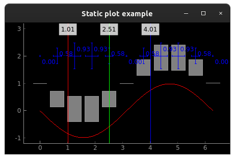

.. container:: collapsible-block

   .. container:: collapsible-title

      .. raw:: html

         Show contents of static_plot_example.py...

   .. literalinclude:: ../../../examples/graph/static_plot_example.py

.. raw:: html

   

Showcase of available data representation types
-----------------------------------------------

To launch this example from the project root, run:

.. code-block:: bash

   python examples/graph/data_representation_types_example.py

This example shows combination of different data presentation types in a :class:`~accwidgets.graph.ScrollingPlotWidget`.
The displayed styles are:

* curve
* bar graph
* injection bar graph
* scatter plot
* timestamp marker

Each of the data items is attached to its own data source producing a sin curve.

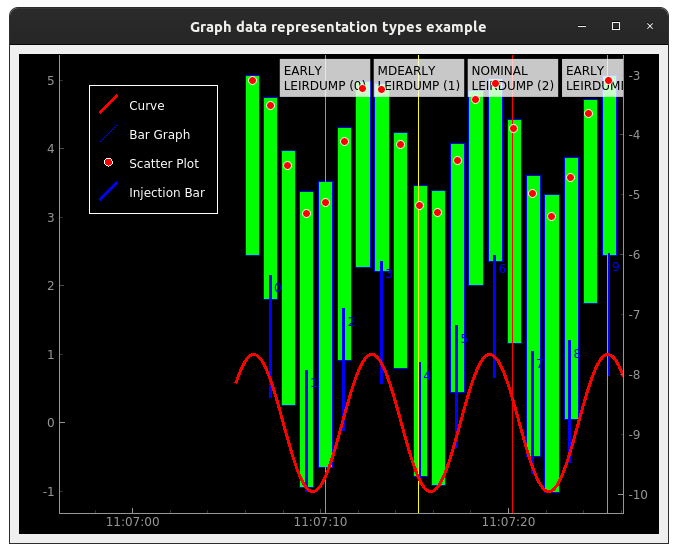

.. container:: collapsible-block

   .. container:: collapsible-title

      .. raw:: html

         Show contents of data_representation_types_example.py...

   .. literalinclude:: ../../../examples/graph/data_representation_types_example.py

.. raw:: html

   

Multi Y-axis live plotting example
----------------------------------

To launch this example from the project root, run:

.. code-block:: bash

   python examples/graph/multi_y_axis_live_example.py

Example of a window displaying two cyclic plot curves placed against two independent Y-axes. A cyclic plot
curve overwrites itself when the visible time span fills up. The Y-axes are part of
:ref:`"layer" concept <widgets/graphs/concepts:Layer concept>` that is composed of a view box (containing the curve) and the
corresponding Y-axis. In this example, both left and right Y-axes can be panned or zoomed individually to influence
the related curves. When panning or dragging on main plot canvas, the action is synchronized across all Y-axes.
This plot is attached to an extra source for timing updates which controls the time span of data shown by the plot.

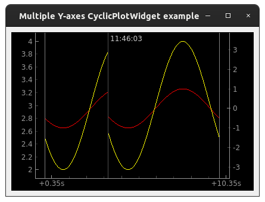

.. container:: collapsible-block

   .. container:: collapsible-title

      .. raw:: html

         Show contents of multi_y_axis_live_example.py...

   .. literalinclude:: ../../../examples/graph/multi_y_axis_live_example.py

.. raw:: html

   

Multi Y-axis static plotting example
------------------------------------

To launch this example from the project root, run:

.. code-block:: bash

   python examples/graph/multi_y_axis_static_example.py

accwidgets graphs offer the possibility to plot against multiple Y-axes. Each additional Y-axis is attached to an
extra view box, the area in which e.g. a curve is drawn in. The Y-axis and its attached view box are grouped
together as a :ref:`"layer" concept <widgets/graphs/concepts:Layer concept>`. Each layer has its own user given string
identifier. For this example we can use PyQtGraph's :class:`~pyqtgraph.PlotDataItem`, which is a simple static curve
without extra capabilities. The X-axis is defined by an array of simple float values, instead of timestamps.

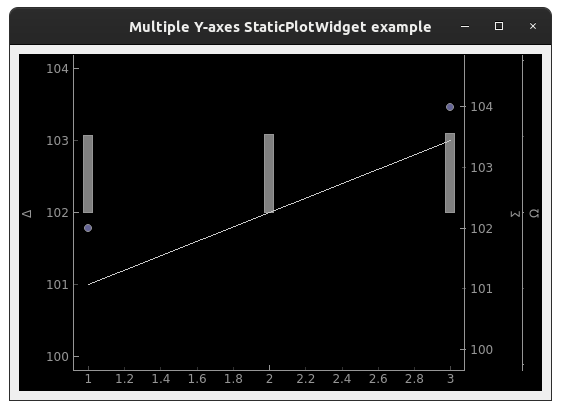

.. container:: collapsible-block

   .. container:: collapsible-title

      .. raw:: html

         Show contents of multi_y_axis_static_example.py...

   .. literalinclude:: ../../../examples/graph/multi_y_axis_static_example.py

.. raw:: html

   

Curve fitting example
---------------------

To launch this example from the project root, run:

.. code-block:: bash

   python examples/graph/curve_fitting_example.py

This example shows fitting a sinus curve into a plot showing live data as a scatter plot.

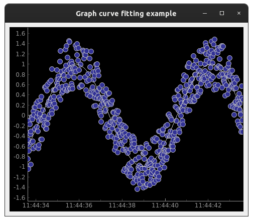

.. container:: collapsible-block

   .. container:: collapsible-title

      .. raw:: html

         Show contents of curve_fitting_example.py...

   .. literalinclude:: ../../../examples/graph/curve_fitting_example.py

.. raw:: html

   

EditablePlotWidget example
--------------------------

To launch this example from the project root, run:

.. code-block:: bash

   python examples/graph/editable_chart_example.py

This example shows the basic usage of the :class:`~accwidgets.graph.EditablePlotWidget` with the standard curve
and standard plot configuration. In the window, 2 top graphs represent separate curve editors, that can be used to
propagate changes to the same control system location. In this case, committing changes from either will override
previous changes, even if they were sent from another graph. The bottom graph represents the values that are
recorded in the control system. Switching between graphs is done by double-clicking them in the editing mode.

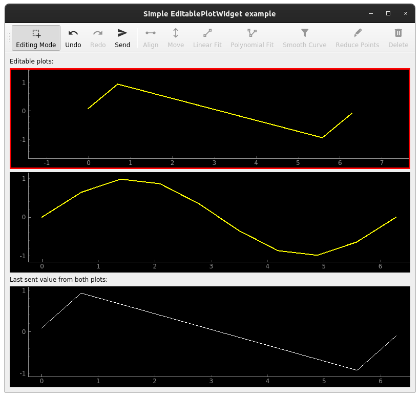

.. container:: collapsible-block

   .. container:: collapsible-title

      .. raw:: html

         Show contents of editable_chart_example.py...

   .. literalinclude:: ../../../examples/graph/editable_chart_example.py

.. raw:: html

   

Custom editable transformations example
---------------------------------------

To launch this example from the project root, run:

.. code-block:: bash

   python examples/graph/editable_chart_custom_transformation_example.py

This example shows how to add a custom transformation to :class:`~accwidgets.graph.EditingToolBar` that is used in
tandem with :class:`~accwidgets.graph.EditablePlotWidget`.

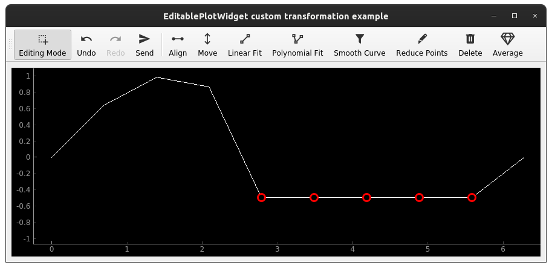

.. container:: collapsible-block

   .. container:: collapsible-title

      .. raw:: html

         Show contents of editable_chart_custom_transformation_example.py...

   .. literalinclude:: ../../../examples/graph/editable_chart_custom_transformation_example.py

.. raw:: html

   

Example of mixing historical and live data
------------------------------------------

To launch this example from the project root, run:

.. code-block:: bash

   python examples/graph/historical_live_data_example.py

Example of a graph that appends incoming live data to pre-existing data taken from the logging system.
Even though the points are not emitted in the order of their timestamps, they are still displayed in the
right order.

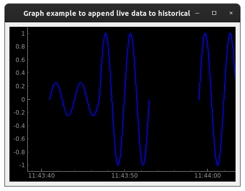

.. container:: collapsible-block

   .. container:: collapsible-title

      .. raw:: html

         Show contents of historical_live_data_example.py...

   .. literalinclude:: ../../../examples/graph/historical_live_data_example.py

.. raw:: html

   

Light background example
------------------------

To launch this example from the project root, run:

.. code-block:: bash

   python examples/graph/light_background_example.py

This example shows the way to create plots with a light background color and dark axes, all of which fits the
default Qt window look.

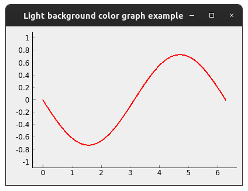

.. container:: collapsible-block

   .. container:: collapsible-title

      .. raw:: html

         Show contents of light_background_example.py...

   .. literalinclude:: ../../../examples/graph/light_background_example.py

.. raw:: html

   

Custom axis ticks example
-------------------------

To launch this example from the project root, run:

.. code-block:: bash

   python examples/graph/custom_axis_ticks_example.py

This example shows the easiest way to introduce custom ticks to one of the plot's axes.

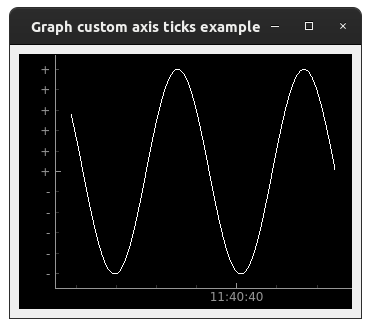

.. container:: collapsible-block

   .. container:: collapsible-title

      .. raw:: html

         Show contents of custom_axis_ticks_example.py...

   .. literalinclude:: ../../../examples/graph/custom_axis_ticks_example.py

.. raw:: html

   

Qt Slot example
---------------

To launch this example from the project root, run:

.. code-block:: bash

   python examples/graph/qt_slot_example.py

This example features a plot with a single curve. Instead of the curve being created from an
:class:`~accwidgets.graph.UpdateSource`, data is directly pushed into the plot widget's slot. This slot in turn
takes care of curve creation. This slot is a useful shortcut, when plot widget needs to be directly connected in
Qt Designer, and there's no necessarily room for custom code that instantiates update source objects.

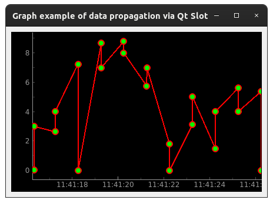

.. container:: collapsible-block

   .. container:: collapsible-title

      .. raw:: html

         Show contents of qt_slot_example.py...

   .. literalinclude:: ../../../examples/graph/qt_slot_example.py

.. raw:: html

   

Dynamic time span example
-------------------------

To launch this example from the project root, run:

.. code-block:: bash

   python examples/graph/dynamic_time_span_example.py

The configuration used when creating the plot can also be changed after the creation. This example shows a window
with ability to adjust the visible time span.

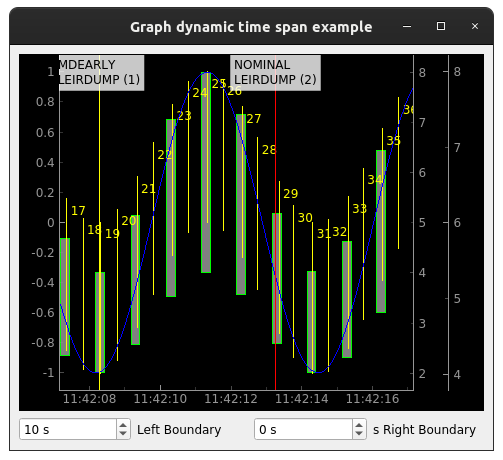

.. container:: collapsible-block

   .. container:: collapsible-title

      .. raw:: html

         Show contents of dynamic_time_span_example.py...

   .. literalinclude:: ../../../examples/graph/dynamic_time_span_example.py

.. raw:: html

   

Dynamic plotting style example
------------------------------

To launch this example from the project root, run:

.. code-block:: bash

   python examples/graph/dynamic_plotting_style_example.py

The configuration used when creating the plot can also be changed after the creation. This example shows
a window with different input elements that can be used to change the configuration on a running plot that
is displaying data.

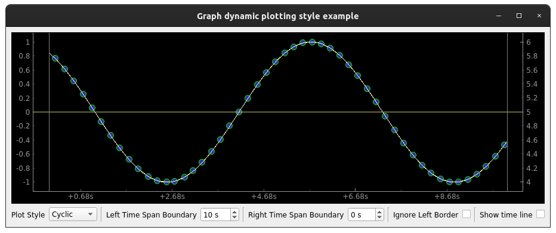

.. container:: collapsible-block

   .. container:: collapsible-title

      .. raw:: html

         Show contents of dynamic_plotting_style_example.py...

   .. literalinclude:: ../../../examples/graph/dynamic_plotting_style_example.py

.. raw:: html

   

Multi-threading example
-----------------------

To launch this example from the project root, run:

.. code-block:: bash

   python examples/graph/threading_example.py

Example with a plot that receives data updates from a separate thread. Plot and update source are created in the main
GUI thread. The new data on the other hand is sent in an extra thread.

.. note:: You do **not need** a multi-threaded application necessarily. This example is simply for demonstrating
          the ability to properly display data produced in another thread. This is ensured by curve and
          :class:`~accwidgets.graph.UpdateSource` communicating over Qt signals, which can transmit data across
          threads.

An example use-case for multi-threaded scenario could be `JAPC <https://wikis.cern.ch/display/InCA/JAPC>`__ callbacks
that are executed in a separate thread from Java thread pool.

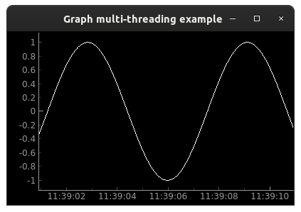

.. container:: collapsible-block

   .. container:: collapsible-title

      .. raw:: html

         Show contents of threading_example.py...

   .. literalinclude:: ../../../examples/graph/threading_example.py

.. raw:: html

   

