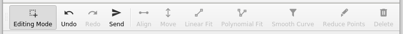
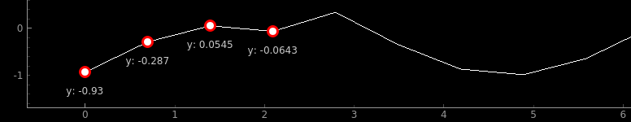
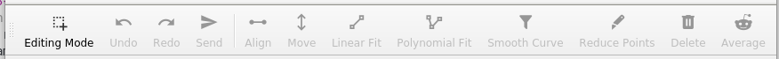
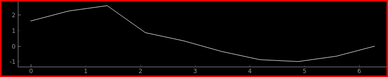

How to use
==========

You can import Graph from :mod:`accwidgets` as follows:

.. code-block:: python

   from accwidgets import graph as accgraph

**Contents:**

- `Create a plot`_
- `Show data in the plot`_

  * `Using pure PyQtGraph items`_

- `Edit data using plots`_

  * :ref:`Update Source Editable`
  * `Editing Toolbar`_

    - `Extending the Editing Toolbar`_

  * `Multiple plots`_
  * `Application example`_

Create a plot
-------------

To display any widget, it is essential to create a new :class:`QApplication` with a :class:`QMainWindow` that will
accommodate GUI components:

.. code-block:: python
   :linenos:

   import sys
   from qtpy.QtWidgets import QApplication, QMainWindow
   from accwidgets import graph as accgraph

   # The window our plot will be displayed in
   class MainWindow(QMainWindow):
       ...

   def run():
       app = QApplication(sys.argv)
       window = MainWindow()
       window.show()
       sys.exit(app.exec_())

   if __name__ == "__main__":
       run()

Next, create a plot widget fitting the desired :ref:`plotting style <widgets/graphs/concepts:Plotting Styles>` and assign it as main
window's content. In this example, the plot will be showing last 30 seconds of data.

**Create plot widget**

.. code-block:: python
   :linenos:

   class MainWindow(QMainWindow):

       def __init__(self, *args, **kwargs):
           super().__init__(*args, **kwargs)
           ...
           # Create a scrolling plot widget
           self.plot = accgraph.ScrollingPlotWidget(time_span=30.0, parent=self)
           self.setCentralWidget(self.plot)

Show data in the plot
---------------------

So far we had an empty widget. Now is the time to display actual data, benefiting from widget's live data
plotting capabilities. All views provided by Graph component follow the
:ref:`update-source and data-model pattern <widgets/graphs/concepts:Data Model and Update Source>`. Hence, the order of adding data to
the plot is the following:

#. Create an :green:`UpdateSource`
#. Create a :red:`View`, passing the :green:`UpdateSource` to it

Behind the scenes, Graph will setup necessary links to ensure data propagation:

#. The :red:`View` creates a :blue:`Model`, passing the :green:`UpdateSource` to it
#. The :blue:`Model` subscribes to the :green:`UpdateSource`'s updates
#. The :red:`View` subscribes to the :blue:`Model`'s updates

In this example, we will display a curve, receiving data from a ``ZeroSource`` instance, which is implemented in the
:ref:`Update Source General` chapter.

.. code-block:: python
   :linenos:

   class MainWindow(QMainWindow):

       def __init__(self, *args, **kwargs):
           super().__init__(*args, **kwargs)
           ...
           self.plot = accgraph.ScrollingPlotWidget(parent=self)
           self.setCentralWidget(self.plot)
           # 1. Create an UpdateSource
           source = ZeroSource()
           # 2. Create a View and tell it, where the updates come from
           self.plot.addCurve(data_source=source)

**We are done!** Every time ``ZeroSource`` emits any new data, our curve will automatically receive
and display it in the right position. We neither have to store any data ourselves nor make sure that we remove
old data from the curve, once it is out of view range.

Using pure PyQtGraph items
--------------------------

Graph is also compatible with pure PyQtGraph plotting items.

.. code-block:: python
   :linenos:

   import sys
   from qtpy.QtWidgets import QApplication, QMainWindow
   from accwidgets import graph as accgraph
   import pyqtgraph as pg

   class MainWindow(QMainWindow):

       def __init__(self, *args, **kwargs):
           super().__init__(*args, **kwargs)
           self.show()
           self.resize(800, 600)
           # Static Plot, the x axis displays float values
           self.plot = accgraph.StaticPlotWidget(parent=self)
           self.setCentralWidget(self.plot)
           # Static PyQtGraph curve
           pyqtgraph_static_curve = pg.PlotDataItem([0.0, 1.0, 1.5, 1.75])
           # Add the curve to our plot
           self.plot.addItem(item=pyqtgraph_static_curve)

Edit data using plots
---------------------

It is possible to edit **curve** data inside Graph via mouse interactions, or by applying predefined functions.

.. _Update Source Editable:

Update Source
^^^^^^^^^^^^^

Similar to the example above, data communication will be relayed through
:class:`~accwidgets.graph.UpdateSource` subclass. Here, it will not only define where the
**initial data comes from**, but also what happens **after data modifications have been committed**.

In our example, we implement the source, as shown below. The edit handler in this example will simply print
the update data.

.. note:: Data changes are committed only after "Send" button is pressed in the `Editing Toolbar`_.

**Data Source for Editable Chart**

.. code-block:: python
   :linenos:

   import math
   import numpy as np
   from qtpy.QtCore import QTimer
   from accwidgets import graph as accgraph

   class DemoSource(accgraph.UpdateSource):

       def __init__(self):
           super().__init__()
           x = np.linspace(0, 2 * math.pi, 20)
           y = np.sin(x)
           data = accgraph.CurveData(x, y)
           self._timer = QTimer()
           self._timer.singleShot(0, lambda: self.new_data(data))

       def handle_data_model_edit(self, data: accgraph.CurveData):
           print("~~~~~~~~~~~ Received Update ~~~~~~~~~~~\n"
                 f"X-values of the received curve \n{data.x}\n"
                 f"Y-values of the received curve \n{data.y}")

Editing Toolbar
^^^^^^^^^^^^^^^

Editing Toolbar is another part required for editing. It is a :class:`QToolBar`-based widget that provides
common functionality for the editable plot.

   Editing Toolbar

The purpose of the Editing Toolbar:

- Switch mouse drag modes between: 1. panning the viewport; 2. point selection
- Undo / Redo data manipulation
- Commit performed changes and send them to the UpdateSource
- Apply functions to the selected points, e.g. "Smooth Curve"

When data points are selected using "Editing Mode", they will be marked. To move the selected points, simply drag them
with the mouse. The position labels are optional and turned off by default.

   Selected data points shown as circular thumbs

After the editing is finished, the updated curve can be relayed through the UpdateSource's editing handler by clicking
"Send" button.

.. note:: All of the curve data points are relayed, not just the modified ones.

Given the UpdateSource example :ref:`implemented above <Update Source Editable>`, the coordinates of the points will
be printed in the standard output:

.. code-block:: bash

   $ python wiki_example.py
   ~~~~~~~~~~~ Received Update ~~~~~~~~~~~
   X-values of the received curve
   [0.67228565, 043495787 0.39541749 1.12506711 1.82516446 2.15585843
    2.35356717 2.61038046 3.00017896 3.78893313 3.9570896  3.59330519
    2.07698221 0.69364446]
   Y-values of the received curve
   [0.04055058 0.53195801 0.99779419 1.27787711 1.33665913 1.08635888
    0.80151501 1.07033754 1.33288473 1.11946762 0.83108498 -0.01891415
    -0.90711138 -0.00170683]

Extending the Editing Toolbar
.............................

Editing Toolbar offers a number of default functions to transform data points. In addition, user may implement custom
functions and add them to the toolbar. It takes 2 bits:

- :class:`QAction` object that defines the appearance of the function in the toolbar
- ``transformation_function(input: accgraph.CurveData) -> accgraph.CurveData`` that will be triggered by the action
- Register these 2 components with :meth:`~accwidgets.graph.EditingToolBar.add_transformation`

It is safe for the transformation function to operate directly on the input curve, as it is only a copy of the
original data.

.. note:: The curve passed to the transformation function is not the entire curve, but the selected points.

The number of points returned from the transformation function is allowed to differ from the input. They will be
sorted according to their X value.

The new transformation will be appended in the Editing Toolbar on the right.

   Custom transformations in the Editing Toolbar

Multiple plots
^^^^^^^^^^^^^^

It is possible to have editing functionality on more than one plot.

.. note:: The Editing Toolbar has to be **connected to all plots** that are supposed to be controlled.

If more than one plot is connected, any of them can be selected for editing by double-clicking. The selected plot
will be highlighted by a red frame. The frame **does not appear** when there's only one plot available for editing.

   Selected plot highlighted by a red frame

.. note:: All actions except "Editing Mode" are executed on the selected plot.

          - "Send" button is only enabled when a plot is selected for editing and at least one modification has been performed
          - Undo / Redo is always executed on the currently selected plot
          - Functions are only enabled when a plot is selected and data points on that plot are also highlighted.

Application example
^^^^^^^^^^^^^^^^^^^

This example shows how to use an Editable Plot and the Editing Toolbar in a window:

.. code-block:: python
   :linenos:

   import sys
   from qtpy.QtWidgets import (
       QApplication,
       QVBoxLayout,
       QMainWindow,
       QWidget,
       QAction,
   )
   from qtpy.QtCore import Qt
   import qtawesome as qta
   import accwidgets.graph as accgraph

   class MainWindow(QMainWindow):

       def __init__(self, *args, **kwargs):
           super().__init__(*args, **kwargs)

           self.plot = accgraph.EditablePlotWidget()
           source = DemoSource()  # Source for our curve
           curve: accgraph.EditablePlotCurve = self.plot.addCurve(data_source=source)  # Add point to the plot
           curve.selection.points_labeled = True  # Each selected point is labeled with its position
           curve.selection.drag_direction = accgraph.DragDirection.BOTH  # Optional -> x, y, both; y is default

           self.bar = accgraph.EditingToolBar()  # The toolbar needed to control the plot's editing
           self.bar.setToolButtonStyle(Qt.ToolButtonTextUnderIcon)  # We want text below under our icons
           self.bar.connect(self.plot)  # Establish connection between plot and the bar

           self.avg_action = QAction(qta.icon("fa5b.reddit-alien"), "Average")  # QAction with icon and text
           self.bar.add_transformation(action=self.avg_action, transformation=self.avg)  # Add the transformation to the bar

           main_container = QWidget()
           self.setCentralWidget(main_container)
           main_layout = QVBoxLayout()
           main_container.setLayout(main_layout)
           main_layout.addWidget(self.plot)
           self.addToolBar(self.bar)  # Alternatively it can be added to the main layout using addWidget()
           self.show()

       @staticmethod
       def avg(curve: accgraph.CurveData):
           curve.y = np.average(curve.y)  # Replace all y values with their common average
           return curve  # Return the altered curve

   if __name__ == "__main__":
       app = QApplication(sys.argv)
       _ = MainWindow()
       sys.exit(app.exec_())
