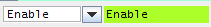

.. rst_epilog sometimes fails, so we need to include this explicitly, for colors
.. include:: <s5defs.txt>

Widgets
=======

The following is a list of widgets that are requested (implemented ones have status |done|).

.. table::
   :widths: 18 16 42 24

   =====================  ================  ================  ===============================================
   Name                   Status            Preview           Comments
   ---------------------  ----------------  ----------------  -----------------------------------------------
   |app-frame-link|       |done|            |appframe|        Standard shell for PyQt accelerator
                                                              applications
   |livecharts-link|      |done|            |livecharts|      JDataViewer-like features, PyQtGraph derivative
   |trim-link|            |done|            |trim|
   |propedit-link|        |done|            |propedit|        Allows to explicitly Get/Set one or more fields
                                                              of a specific device property
   |lsa-link|             |done|            |lsaselector|     Displays and selects LSA cycles
   |led-link|             |done|            |led|             Works with arbitrary colors or a predefined
                                                              status: :attr:`~accwidgets.led.Led.Status.ON`,
                                                              :attr:`~accwidgets.led.Led.Status.OFF`,
                                                              :attr:`~accwidgets.led.Led.Status.WARNING`,
                                                              :attr:`~accwidgets.led.Led.Status.ERROR`,
                                                              :attr:`~accwidgets.led.Led.Status.NONE`
   |spinner-link|         |spinner-status|  |spinner|
   |device-sel-link|      |na|              |devicesel|
   |toggle-trigger-link|  |na|              |toggle-trigger|  For JAPC context
   |status-led-link|      |na|                                Changes its state only when all linked
                                                              properties change to a specific state
   |log-link|             |done|            |logconsole|      Capture standard Python loggers, or custom logs
                                                              via custom model implementation
   |timing-link|          |done|            |timing|          `"XTIM" <https://wikis.cern.ch/display/TIMING/XTIM>`__
                                                              RDA device based timing
   |rbac-link|            |done|            |rbac|            :mod:`pyrbac`-backed component. Needs manual
                                                              synchronization with Java RBAC libraries.
   =====================  ================  ================  ===============================================

In addition to explicitly requested widgets, those available in
`Inspector <https://wikis.cern.ch/display/INSP/Inspector+Home>`__ will be implemented in the order of
their usage statistics gathered from existing Inspector projects.
`Overview <https://wikis.cern.ch/display/DEV/PyDM+vs+Inspector#PyDMvsInspector-WidgetComparison>`__.

.. note:: If you would like to request the implementation of a new widget, or share your own implementation,
          you can do so, in the `Community Widgets <https://wikis.cern.ch/display/ACCPY/Community+Widgets>`__ page.

.. |livecharts-link| replace:: :doc:`Live Charts <graphs/index>`

.. |lsa-link| replace:: :doc:`LSA Selector <lsa_selector/index>`

.. |device-sel-link| replace:: `Device selector <https://issues.cern.ch/browse/ACCPY-44>`__

.. |app-frame-link| replace:: :doc:`Application frame <app_frame/index>`

.. |toggle-trigger-link| replace:: `Enable/disable trigger <https://issues.cern.ch/browse/ACCPY-38>`__

.. |lsa-status| replace:: `Contribution by Kevin Li to be reviewed. <https://issues.cern.ch/browse/ACCPY-25>`__

.. |status-led-link| replace:: `Status LED <https://issues.cern.ch/browse/ACCPY-251>`__

.. |propedit-link| replace:: :doc:`PropertyEdit <property_edit/index>`

.. |log-link| replace:: :doc:`LogConsole <log_console/index>`

.. |rbac-link| replace:: :doc:`RbaButton <rbac/index>`

.. |trim-link| replace:: :ref:`Trim function editor (Editable charts) <widgets/graphs/usage:Edit data using plots>`

.. |timing-link| replace:: :doc:`Timing bar <timing_bar/index>`

.. |spinner-link| replace:: `Spinner (wheel field) <https://issues.cern.ch/browse/ACCPY-32>`__

.. |spinner-status| replace:: `Contribution by Georges Trad to be reviewed. <https://issues.cern.ch/browse/ACCPY-32>`__

.. |led-link| replace:: :doc:`LED <led/index>`

.. |done| replace:: :green:`Available`

.. |na| replace:: N/A

.. |wip| replace:: :blue:`In progress`

.. |devicesel| image:: ../img/ascdevicecontrolbox.png

.. |logconsole| image:: ../img/logconsole.png
   :width: 250px

.. |propedit| image:: ../img/propedit.png

.. |trim| image:: ../img/trimeditor.png
   :width: 250px

.. |timing| image:: ../img/timing_bar.png
   :width: 250px

.. |rbac| image:: ../img/rbac_loggedin.png

.. |led| image:: ../img/led.png

Explore individual widgets
--------------------------

.. toctree::
   :maxdepth: 1

   app_frame/index
   graphs/index
   property_edit/index
   lsa_selector/index
   led/index
   log_console/index
   timing_bar/index
   rbac/index
   qt/modules