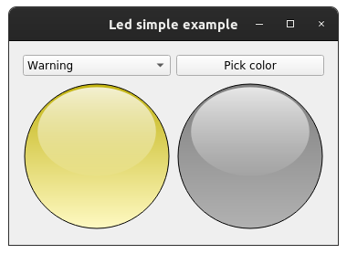
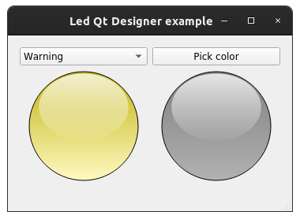

Examples
==========

This page briefly explains the examples, that can be found in ``examples/led`` directory of the project's
`source code <https://gitlab.cern.ch/acc-co/accsoft/gui/accsoft-gui-pyqt-widgets>`__. To ensure presence of additional
packages needed to run examples, it is advised to install a special ``examples`` category:

.. code-block:: bash

   pip install .[examples]

- `Programmatic example`_
- `Qt Designer example`_

Programmatic example
--------------------

To launch this example from the project root, run:

.. code-block:: bash

   python examples/led/code_example.py

This example shows the simple integration of :class:`~accwidgets.led.Led` widget into a window. 2
:class:`~accwidgets.led.Led`s are placed side by side, one of
which is controlled via "Status" combobox, that modifies :class:`~accwidgets.led.Led` color based on the predefined
status, while another :class:`~accwidgets.led.Led` accepts an arbitrary RBG color from the color picker.

.. container:: collapsible-block

   .. container:: collapsible-title

      .. raw:: html

         Show contents of code_example.py...

   .. literalinclude:: ../../../examples/led/code_example.py

.. raw:: html

   

Qt Designer example
-------------------

To launch this example from the project root, run:

.. code-block:: bash

   python examples/led/designer_example.py

This example shows the simple integration of :class:`~accwidgets.led.Led` widget into a window. 2
:class:`~accwidgets.led.Led`s are placed side by side, one of
which is controlled via "Status" combobox, that modifies :class:`~accwidgets.led.Led` color based on the predefined
status, while another :class:`~accwidgets.led.Led` accepts an arbitrary RBG color from the color picker.

.. container:: collapsible-block

   .. container:: collapsible-title

      .. raw:: html

         Show contents of designer_example.py...

   .. literalinclude:: ../../../examples/led/designer_example.py

.. raw:: html

   

