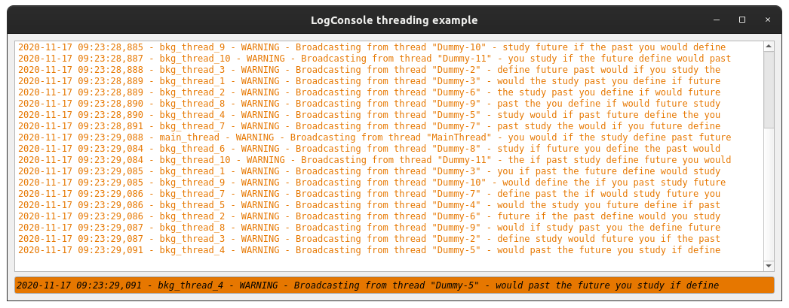

Examples
==========

This page briefly explains the examples, that can be found in ``examples/log_console`` directory of the project's
`source code <https://gitlab.cern.ch/acc-co/accsoft/gui/accsoft-gui-pyqt-widgets>`__.

- `Simple example`_
- `Dock widget example`_
- `Qt Designer example`_
- `Multiple loggers example`_
- `Custom formatter example`_
- `Custom model example`_
- `Child loggers example`_
- `Ignored loggers example`_
- `Threading example`_
- `QSS styling example`_

Simple example
--------------

To launch this example from the project root, run:

.. code-block:: bash

   python examples/log_console/code_example.py

This example shows the simplest and the most minimalistic integration of :class:`~accwidgets.log_console.LogConsole`
widgets with the default setup in code. It will attach to the root Python logger. Buttons allow simulating log entries.

.. container:: collapsible-block

   .. container:: collapsible-title

      .. raw:: html

         Show contents of code_example.py...

   .. literalinclude:: ../../../examples/log_console/code_example.py

.. raw:: html

   

Dock widget example
-------------------

To launch this example from the project root, run:

.. code-block:: bash

   python examples/log_console/dock_widget_example.py

This example shows how to integrate a :class:`~accwidgets.log_console.LogConsoleDock` into the :class:`QMainWindow`.
In this example, floating and collapsing of the dock is disabled.

.. container:: collapsible-block

   .. container:: collapsible-title

      .. raw:: html

         Show contents of dock_widget_example.py...

   .. literalinclude:: ../../../examples/log_console/dock_widget_example.py

.. raw:: html

   

Qt Designer example
-------------------

To launch this example from the project root, run:

.. code-block:: bash

   python examples/log_console/designer_example.py

This example shows the integration of :class:`~accwidgets.log_console.LogConsole` via Qt Designer. To show the
additional features, compared to `Simple example`_, Qt Designer file sets up signal-slot connection for custom
buttons to freeze the console. It will attach to the root Python logger. Buttons allow simulating log entries.

.. container:: collapsible-block

   .. container:: collapsible-title

      .. raw:: html

         Show contents of designer_example.py...

   .. literalinclude:: ../../../examples/log_console/designer_example.py

.. raw:: html

   

Multiple loggers example
------------------------

To launch this example from the project root, run:

.. code-block:: bash

   python examples/log_console/multiple_loggers_example.py

This example shows the integration of :class:`~accwidgets.log_console.LogConsole` with custom loggers.
To achieve that, an instance of :class:`~accwidgets.log_console.LogConsoleModel` is created, which receives the
list of dynamically generated loggers. Buttons allow simulating log entries for each of the generated logger.

.. container:: collapsible-block

   .. container:: collapsible-title

      .. raw:: html

         Show contents of multiple_loggers_example.py...

   .. literalinclude:: ../../../examples/log_console/multiple_loggers_example.py

.. raw:: html

   

Custom formatter example
------------------------

To launch this example from the project root, run:

.. code-block:: bash

   python examples/log_console/custom_formatter_example.py

This example shows how to use a custom formatter implementation by subclassing the
:class:`~accwidgets.log_console.AbstractLogConsoleFormatter`. Here, the custom formatter has a single configuration
option "Show smiley face", which will prefix messages with ``:)``. Buttons allow simulating log entries for each of
the generated logger.

.. container:: collapsible-block

   .. container:: collapsible-title

      .. raw:: html

         Show contents of custom_formatter_example.py...

   .. literalinclude:: ../../../examples/log_console/custom_formatter_example.py

.. raw:: html

   

Custom model example
--------------------

To launch this example from the project root, run:

.. code-block:: bash

   python examples/log_console/custom_model_example.py

This example shows how to use a custom model implementation by subclassing the
:class:`~accwidgets.log_console.AbstractLogConsoleModel`. This example implementation does not benefit from
Python loggers at all, and rather generates log events based on the simulated timer.

.. container:: collapsible-block

   .. container:: collapsible-title

      .. raw:: html

         Show contents of custom_model_example.py...

   .. literalinclude:: ../../../examples/log_console/custom_model_example.py

.. raw:: html

   

Child loggers example
---------------------

To launch this example from the project root, run:

.. code-block:: bash

   python examples/log_console/child_loggers_example.py

This example shows the integration of :class:`~accwidgets.log_console.LogConsole` with child loggers. Python's
:mod:`logging` module maintains a parent-child relationships of loggers, based on their names. Likewise, handlers
can be used to capture concrete logger's records or records of its child loggers. In this example, model is set up to
track *logger1* and *logger2* and **root**. *logger1* has no children, whereas *logger2* has a child *logger2.child*.
While only configuration of *logger2* is available in the console's preferences, it affects *logger2.child* in the same
way. In addition, *logger3* and *logger4.child* are used to emit log messages, but are not explicitly tracked by the
model. They will be handled by the **root** handler. If **root** handler was not added to the model, these logs would
be ignored. Buttons allow simulating log entries for each of the available loggers.

.. container:: collapsible-block

   .. container:: collapsible-title

      .. raw:: html

         Show contents of child_loggers_example.py...

   .. literalinclude:: ../../../examples/log_console/child_loggers_example.py

.. raw:: html

   

Ignored loggers example
-----------------------

To launch this example from the project root, run:

.. code-block:: bash

   python examples/log_console/ignored_loggers_example.py

This example shows how :class:`~accwidgets.log_console.LogConsole` can ignore messages from certain loggers. To
achieve that, we pass custom loggers to the model that we want to handle, and make sure to not pass the **root** logger
(usually created with the call :func:`logging.getLogger` without arguments) that would otherwise handle the rest of all
messages. In this example, only *logger1* messages appear in the console, while *logger2* are completely ignored.
Buttons allow simulating log entries for each of the available loggers.

.. container:: collapsible-block

   .. container:: collapsible-title

      .. raw:: html

         Show contents of ignored_loggers_example.py...

   .. literalinclude:: ../../../examples/log_console/ignored_loggers_example.py

.. raw:: html

   

Threading example
-----------------

To launch this example from the project root, run:

.. code-block:: bash

   python examples/log_console/threading_example.py

This example shows how :class:`~accwidgets.log_console.LogConsole` works when logging messages from multiple threads.
Python's :mod:`logging` module is thread-safe and there is no specific logic that is needed to handle multi-threading.
For the sake of example, logs are emitted automatically using timers.

.. container:: collapsible-block

   .. container:: collapsible-title

      .. raw:: html

         Show contents of threading_example.py...

   .. literalinclude:: ../../../examples/log_console/threading_example.py

.. raw:: html

   

QSS styling example
-------------------

To launch this example from the project root, run:

.. code-block:: bash

   python examples/log_console/styling_example.py

This is the example of stylizing the :class:`~accwidgets.log_console.LogConsole` with custom colors using
QSS stylesheets. We are presenting the color scheme that matches the dark mode style.
It will attach to the root Python logger. Buttons allow simulating log entries.

.. container:: collapsible-block

   .. container:: collapsible-title

      .. raw:: html

         Show contents of styling_example.py...

   .. literalinclude:: ../../../examples/log_console/styling_example.py

.. raw:: html

   

