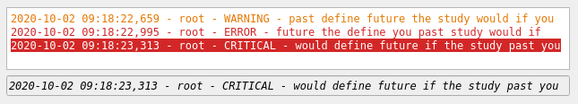

LogConsole
==========

Log console is a widget to display logs in a HTML-stylized list.

- `Dock`_
- `Model`_

  * `Python logger hierarchy`_

- `Context menu`_
- `Formatter`_
- `Further read`_

The last message is always duplicated in a single-line field and the color related to its severity level
is flashed in that field to attract end-user's attention. The widget has two modes: collapsed and expanded,
where a full log view is visible or hidden respectively. The single-line field of the last message is visible
in either mode.

The widget comes with a Qt Designer plugin. However, it only makes sense if you want a custom log console in a custom
location. For standardized CERN workflows, it may be more appropriate to integrate the widget into the window, rather
than add it as a widget in the Qt Designer. For more information, follow :ref:`widgets/log_console/index:Dock`.

Dock
----

By convention, CERN applications integrate logging widgets in the bottom part of the windows. To integrate the log
console into a :class:`QMainWindow`, it is advised to use the :class:`~accwidgets.log_console.LogConsoleDock` widget
instead of :class:`~accwidgets.log_console.LogConsole` directly. This widget ensures proper user experience when
resizing the console and will look familiar to most users. When log console is in the "expanded" mode
(see :attr:`~accwidgets.log_console.LogConsole.expanded`), the dock widget can be vertically resized. In the
"collapsed" mode, the resizing is not possible and is fixed to only accommodate the single-line last message field.
The mode change can be forbidden by setting the :attr:`~accwidgets.log_console.LogConsole.collapsible` property to
:obj:`False` in cases, when hiding parts of the console is undesirable. A non-collapsible log console does not have
the "arrow button" responsible for collapsing action.

.. seealso:: :ref:`widgets/log_console/examples:Dock widget example`

   Log console dock widget in the collapsed mode

   Log console dock widget in the expanded mode

Model
-----

Log console can work with models that define where logs come from and how they are stored (see
:ref:`widgets/log_console/examples:Custom model example`). If no custom model is provided, the default implementation,
:class:`~accwidgets.log_console.LogConsoleModel` is created that captures Python :mod:`logging` output.

.. seealso:: :ref:`widgets/log_console/examples:Simple example` and
             :ref:`widgets/log_console/examples:Multiple loggers example`

Python logger hierarchy
^^^^^^^^^^^^^^^^^^^^^^^

As mentioned above, default implementation, :class:`~accwidgets.log_console.LogConsoleModel`, works with Python
:mod:`logging` objects. This module maintains a hierarchy of loggers that is based on their names, following a
dot-separated notation similar to Python module names. Thus, *mylogger.sublogger* is considered the child of *mylogger*,
while *mylogger.sublogger.subsublogger* is the grand child. :mod:`logging` also creates a special object, the
**root** logger, that is the root of the hierarchy tree and is a direct or transitive parent for all user-defined
loggers. This object can be accessed by calling :func:`logging.getLogger` without arguments.

:class:`~accwidgets.log_console.LogConsoleModel` follows Python's hierarchy and the perceives the configuration in the
similar fashion. Hence, you may pass a ``logging.getLogger("mylogger")`` to the model's constructor, which will take
control over handling the messages of not only *mylogger* itself, but also *mylogger.sublogger* and any children that
may exist at any point in the application lifecycle. In addition, **root** logger's configuration can take care of all
the messages that do not belong to provided user-defined loggers (and their children), as long as **root** logger itself
is passed to the model's constructor.

.. note:: When no loggers are passed to the model's constructor, **root** logger is implied.

.. seealso:: :ref:`widgets/log_console/examples:Child loggers example`

This mechanism allows ignoring messages from certain loggers to not be displayed in the console. To achieve that, an
explicit list of loggers must be given to the model, making sure that **root** logger is not part of the list. Hence,
only messages that belong to given loggers or their children will be displayed.

.. seealso:: :ref:`widgets/log_console/examples:Ignored loggers example`.

Context menu
------------

Log console provides a context menu on the right mouse click to:

- "Freeze"/"unfreeze" the console ("frozen" console becomes static and does not display new logs, until
  "unfrozen")
- Search for text visible in the console
- Print visible console logs
- Configure the display and capturing of the logs in a "Preferences" dialog

.. figure:: ../../img/logconsole_menu.png
   :align: center
   :alt: Context menu of the log console

   Context menu of the log console

Formatter
---------

While capturing and storing the logging records is managed by the :attr:`~accwidgets.log_console.LogConsole.model`,
:attr:`~accwidgets.log_console.LogConsole.formatter` is responsible for producing the final string. Default
implementation, :class:`~accwidgets.log_console.LogConsoleFormatter`, can show/hide date, time and logger names of
individual records. Custom formatters may have completely different settings.

.. seealso:: :ref:`widgets/log_console/examples:Custom formatter example`

Preferences
-----------

Use can configure the captured logs and the display settings in the "Preferences" dialog accessible from the
:ref:`widgets/log_console/index:Context menu`.

   Preferences dialog

Log severity associated colors are configurable by the user under the "Color coding" group. When such color is
used as background rather than foreground (e.g. in last message field; or in the main text view, when color is
marked as "inverted") the foreground text color is chosen automatically between black and white, to have the best
contrast, based on the background's intensity.

Formatter settings in this dialog are dynamic and depend on the formatter implementation.

Further read
------------

.. toctree::
   :maxdepth: 1

   examples
   api/modules