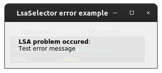

Examples
==========

This page briefly explains the examples, that can be found in ``examples/lsa_selector`` directory of the project's
`source code <https://gitlab.cern.ch/acc-co/accsoft/gui/accsoft-gui-pyqt-widgets>`__. To ensure presence of additional
packages needed to run examples, it is advised to install a special ``examples`` category:

.. code-block:: bash

   pip install .[examples]

- `Basic example`_
- `Qt Designer example`_
- `PyJapc example`_
- `Error example`_
- `Extra configuration example`_
- `Dock widget example`_
- `QSS styling example`_
- `Programmatic styling example`_

Basic example
-------------

To launch this example from the project root, run:

.. code-block:: bash

   python examples/lsa_selector/basic_example.py

This example shows the simplest way of using :class:`~accwidgets.lsa_selector.LsaSelector` widget. For the sake of
example, we are using custom model that does not require connection to LSA servers.

.. container:: collapsible-block

   .. container:: collapsible-title

      .. raw:: html

         Show contents of basic_example.py...

   .. literalinclude:: ../../../examples/lsa_selector/basic_example.py

.. raw:: html

   

Qt Designer example
-------------------

To launch this example from the project root, run:

.. code-block:: bash

   python examples/lsa_selector/designer_example.py

This is the same example as `Basic example`_, but integrating with Qt Designer widget, instead of the
programmatically created one. For the sake of example, we are using custom model that does not require
connection to LSA servers.

.. container:: collapsible-block

   .. container:: collapsible-title

      .. raw:: html

         Show contents of designer_example.py...

   .. literalinclude:: ../../../examples/lsa_selector/designer_example.py

.. raw:: html

   

PyJapc example
--------------

To launch this example from the project root, run:

.. code-block:: bash

   python examples/lsa_selector/pyjapc_example.py

This example shows how to use :class:`~accwidgets.lsa_selector.LsaSelector` widget to drive :mod:`~pyjapc.PyJapc`'s
timing user. For the sake of example, we are using custom model that does not require connection to LSA servers,
and :mod:`pyjapc` is replaced with :mod:`papc` to remove the requirement of real devices and Technical Network.

.. container:: collapsible-block

   .. container:: collapsible-title

      .. raw:: html

         Show contents of pyjapc_example.py...

   .. literalinclude:: ../../../examples/lsa_selector/pyjapc_example.py

.. raw:: html

   

Error example
-------------

To launch this example from the project root, run:

.. code-block:: bash

   python examples/lsa_selector/error_example.py

This is the example of how communication error is displayed to the user. The widget will overlay a label with error
occurred during processing LSA information. For the sake of example, we are using custom model that does not require
connection to LSA servers. Error is simulated by emitting an error signal from the custom model.

.. container:: collapsible-block

   .. container:: collapsible-title

      .. raw:: html

         Show contents of error_example.py...

   .. literalinclude:: ../../../examples/lsa_selector/error_example.py

.. raw:: html

   

Extra configuration example
---------------------------

To launch this example from the project root, run:

.. code-block:: bash

   python examples/lsa_selector/props_example.py

This example shows the way to configure the widget with additional properties. It builds on top of
`Basic example`_, extending it with configuration UI. For the sake of example, we are using custom model
that does not require connection to LSA servers.

.. container:: collapsible-block

   .. container:: collapsible-title

      .. raw:: html

         Show contents of props_example.py...

   .. literalinclude:: ../../../examples/lsa_selector/props_example.py

.. raw:: html

   

Dock widget example
-------------------

To launch this example from the project root, run:

.. code-block:: bash

   python examples/lsa_selector/dock_example.py

This example shows the way of integrating :class:`~accwidgets.lsa_selector.LsaSelector` widget into a dock. Here,
the widget is accommodated on the left side of the window inside a :class:`QDockWidget`. For the sake of example,
we are using custom model that does not require connection to LSA servers.

.. image:: ../../img/examples_lsa_dock.png

.. container:: collapsible-block

   .. container:: collapsible-title

      .. raw:: html

         Show contents of dock_example.py...

   .. literalinclude:: ../../../examples/lsa_selector/dock_example.py

.. raw:: html

   

QSS styling example
-------------------

To launch this example from the project root, run:

.. code-block:: bash

   python examples/lsa_selector/qss_example.py

This is the example of stylizing the widget with custom colors using QSS stylesheets. For the sake of example,
we are using custom model that does not require connection to LSA servers.

.. container:: collapsible-block

   .. container:: collapsible-title

      .. raw:: html

         Show contents of qss_example.py...

   .. literalinclude:: ../../../examples/lsa_selector/qss_example.py

.. raw:: html

   

Programmatic styling example
----------------------------

To launch this example from the project root, run:

.. code-block:: bash

   python examples/lsa_selector/styling_example.py

This is the example of stylizing the widget with custom colors when :ref:`QSS <widgets/lsa_selector/examples:QSS styling example>` is not involved.
For the sake of example, we are using custom model that does not require connection to LSA servers.

.. container:: collapsible-block

   .. container:: collapsible-title

      .. raw:: html

         Show contents of styling_example.py...

   .. literalinclude:: ../../../examples/lsa_selector/styling_example.py

.. raw:: html

   

