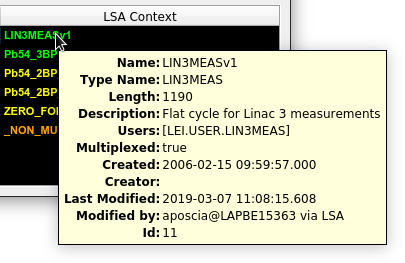
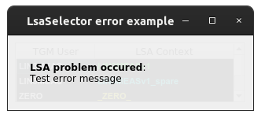
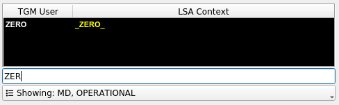

.. rst_epilog sometimes fails, so we need to include this explicitly, for colors
.. include:: <s5defs.txt>
.. include:: ../../extra-s5defs.txt

LsaSelector
===========

.. note:: To start using this widget, make sure to specify ``lsa_selector`` as an extra, when installing
          accwidgets, or use ``all-widgets``. More on :ref:`install:Specifying dependencies`.

:class:`~accwidgets.lsa_selector.LsaSelector` exposes a selectable table with a list of LSA cycles/contexts and
associated timing users.

- `Color scheme`_
- `Tooltips`_
- `Errors`_
- `Configuration`_
- `Further read`_

.. image:: ../../img/lsaselector.png

User can select one cycle at a time, which triggers
:attr:`~accwidgets.lsa_selector.LsaSelector.contextSelectionChanged` signal and
:attr:`~accwidgets.lsa_selector.LsaSelector.userSelectionChanged` for resident contexts. When working with resident
contexts, associated timing user :ref:`can be plugged directly <widgets/lsa_selector/examples:PyJapc example>`
into :class:`~pyjapc.PyJapc`.

The data is accessed via :mod:`pjlsa` library. By default the widget instantiates LSA client connected to the
``gpn`` server. Is is also possible to use a custom :class:`~pjlsa.LSAClient` object by instantiating a
:class:`~accwidgets.lsa_selector.LsaSelectorModel` with ``lsa`` argument and passing it to the widget. This widget
takes full advantage of accwidgets' :ref:`widget-specific dependencies <install:Specifying dependencies>` to not
create a hard dependency on :mod:`pjlsa`, when the widget is not used.

Cycles/contexts are retrieved for a specific accelerator.

.. note:: Not all accelerators that are defined by LSA framework are visible, primarily because they are obsolete:

          * ``LINAC3`` is removed and is part of :attr:`~accwidgets.lsa_selector.LsaSelectorAccelerator.LEIR` now
          * ``LINAC4`` is removed and is part of :attr:`~accwidgets.lsa_selector.LsaSelectorAccelerator.PSB` now
          * ``REX`` has also been removed as obsolete

Color scheme
------------

While color scheme of the widget :ref:`can be customized <widgets/lsa_selector/examples:QSS styling example>`,
the standard set replicates that of the corresponding Java widget. Contexts are colored based on their type as follows:

* :greenbold:`Green`: resident context that is active (belongs to an active timing user)
* :yellowbold:`Yellow`: resident context that is inactive (associated timing user is not active)
* :orangebold:`Orange`: resident context that is non-multiplexed (does not belong to a timing user)
* :cyanbold:`Cyan`: resident context from a spare user (same as active, but coming from a spare supercycle)

In addition, the widget can be configured to display non-resident contexts. In this case, font color will be
:blackbold:`black` for multiplexed and :orangebold:`orange` for non-multiplexed contexts accordingly. Because
non-resident contexts are not mapped to a timing user at the time of introspection, they leave "TGM User" column empty.
While resident contexts are accompanied by a black background, non-resident contexts are typically displayed on the
white background, except for contexts that have potential to become resident (are beam processes that belong to an
active hypercycle and have an associated user) - in this case, they have gray background color.

Tooltips
--------

Each context in the list can be peeked at by hovering the mouse pointer over corresponding row. Summary is then
displayed in the tooltip.

   Tooltip when hovering over a cycle in the list

Errors
------

Because the widget is relying on connection to LSA servers, it is susceptible to connection problems. When the error
happens, the widget rendering is switched to the error mode. Error message is overlaid on top of the widget.

   Connection error in the LSA selector

Configuration
-------------

Default configuration displays only operational resident contexts. It can be changed by setting properties
:attr:`~accwidgets.lsa_selector.LsaSelector.fetchResidentOnly` property. In addition,
:attr:`~accwidgets.lsa_selector.LsaSelector.contextCategories` allows pulling more categories, e.g.
:attr:`~accwidgets.lsa_selector.AbstractLsaSelectorContext.Category.MD`,
:attr:`~accwidgets.lsa_selector.AbstractLsaSelectorContext.Category.ARCHIVED`,
:attr:`~accwidgets.lsa_selector.AbstractLsaSelectorContext.Category.OPERATIONAL`, etc.

By default, user is not able to filter displayed list. It is however possible to filter the list by name, or by
context category. These filters can be enabled via properties
:attr:`~accwidgets.lsa_selector.LsaSelector.showNameFilter` and
:attr:`~accwidgets.lsa_selector.LsaSelector.showCategoryFilter`.

.. note:: Due to the way Qt tables work, filtering the list may select another row in the list, if originally selected
          row disappears. Provided that some applications might immediately react to widget's
          :attr:`~accwidgets.lsa_selector.LsaSelector.contextSelectionChanged` signal by e.g. resubscribing to devices,
          such filtering may have undesirable side effects.

   LSA selector with enabled name and category filters

Further read
------------

.. toctree::
   :maxdepth: 1

   examples
   api/modules
