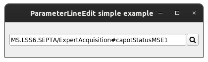
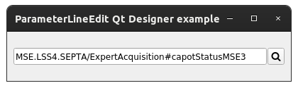
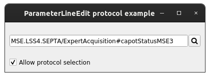
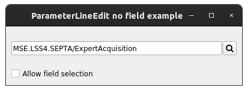
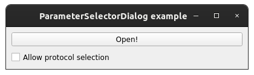
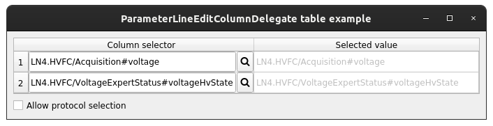
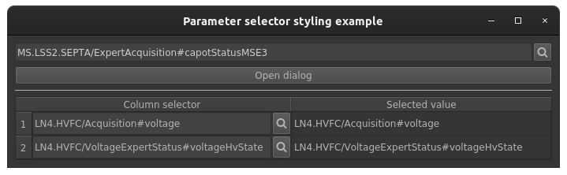

Examples
==========

This page briefly explains the examples, that can be found in ``examples/parameter_selector`` directory of the project's
`source code <https://gitlab.cern.ch/acc-co/accsoft/gui/accsoft-gui-pyqt-widgets>`__. To ensure presence of additional
packages needed to run examples, it is advised to install a special ``examples`` category:

.. code-block:: bash

   pip install .[examples]

- `Basic example`_
- `Qt Designer example`_
- `Protocols example`_
- `No fields example`_
- `Bare dialog example`_
- `Table view example`_
- `QSS styling example`_

Basic example
-------------

To launch this example from the project root, run:

.. code-block:: bash

   python examples/parameter_selector/basic_example.py

This example shows the simplest way of using :class:`~accwidgets.parameter_selector.ParameterLineEdit` widget.
The newly selected parameter name is printed to the console.

.. container:: collapsible-block

   .. container:: collapsible-title

      .. raw:: html

         Show contents of basic_example.py...

   .. literalinclude:: ../../../examples/parameter_selector/basic_example.py

.. raw:: html

   

Qt Designer example
-------------------

To launch this example from the project root, run:

.. code-block:: bash

   python examples/parameter_selector/designer_example.py

This is the the same example as `Basic example`_, but integrating with Qt Designer widget, instead of the
programmatically created one. The newly selected parameter name is printed to the console.

.. container:: collapsible-block

   .. container:: collapsible-title

      .. raw:: html

         Show contents of designer_example.py...

   .. literalinclude:: ../../../examples/parameter_selector/designer_example.py

.. raw:: html

   

Protocols example
-----------------

To launch this example from the project root, run:

.. code-block:: bash

   python examples/parameter_selector/protocol_example.py

This example is similar to `Basic example`_ in terms of widget configuration, but adds an additional option
to use or not use protocols in the selector dialog. Protocol selection may be useful for lower level communication
addresses. The newly selected parameter name is printed to the console.

.. container:: collapsible-block

   .. container:: collapsible-title

      .. raw:: html

         Show contents of protocol_example.py...

   .. literalinclude:: ../../../examples/parameter_selector/protocol_example.py

.. raw:: html

   

No fields example
-----------------

To launch this example from the project root, run:

.. code-block:: bash

   python examples/parameter_selector/no_field_example.py

This example is similar to `Basic example`_ in terms of widget configuration, but adds an additional option
to only select devices and properties, but not fields. The newly selected parameter name is printed to the console.

.. container:: collapsible-block

   .. container:: collapsible-title

      .. raw:: html

         Show contents of no_field_example.py...

   .. literalinclude:: ../../../examples/parameter_selector/no_field_example.py

.. raw:: html

   

Bare dialog example
-------------------

To launch this example from the project root, run:

.. code-block:: bash

   python examples/parameter_selector/dialog_example.py

This example shows the simplest way of using :class:`~accwidgets.parameter_selector.ParameterSelectorDialog` widget.
This is useful if :class:`~accwidgets.parameter_selector.ParameterLineEdit` widget is not fitting the purpose,
hence you can issue a selector dialog manually using any action, for instance, a button press or :class:`QAction`
in the main menu. The newly selected parameter name is printed to the console. User has also a possibility to
configure the dialog for the usage of protocols, just as showcased in `Protocols example`_.

.. container:: collapsible-block

   .. container:: collapsible-title

      .. raw:: html

         Show contents of dialog_example.py...

   .. literalinclude:: ../../../examples/parameter_selector/dialog_example.py

.. raw:: html

   

Table view example
------------------

To launch this example from the project root, run:

.. code-block:: bash

   python examples/parameter_selector/table_example.py

This example shows the way of using :class:`~accwidgets.parameter_selector.ParameterLineEditColumnDelegate` inside
a :class:`QTableView`. Example model is configured to contain 2 columns:

#. The left one will accommodate :class:`~accwidgets.parameter_selector.ParameterLineEdit` widgets
#. On the right the read-only value is displayed, corresponding to the
   :class:`~accwidgets.parameter_selector.ParameterLineEdit` of the same row.

"Enable protocols" checkbox allows configuring additional protocol UI in the dialogs, just as displayed in
`Protocols example_`.

.. container:: collapsible-block

   .. container:: collapsible-title

      .. raw:: html

         Show contents of table_example.py...

   .. literalinclude:: ../../../examples/parameter_selector/table_example.py

.. raw:: html

   

QSS styling example
-------------------

To launch this example from the project root, run:

.. code-block:: bash

   python examples/parameter_selector/styling_example.py

This is the example of stylizing the widget with custom colors using QSS stylesheets. We are presenting the color
scheme that matches the dark mode style. You will find all ways of accessing the selector dialog in this single
example:

- Using :class:`~accwidgets.parameter_selector.ParameterLineEdit`
- Using :class:`~accwidgets.parameter_selector.ParameterSelectorDialog`
- Or using :class:`~accwidgets.parameter_selector.ParameterLineEditColumnDelegate`

The first two are connected together and print/reconfigure the same selector value.
:class:`~accwidgets.parameter_selector.ParameterLineEditColumnDelegate` is not connected with those, and follows the
same logic as in `Table view example`_ (except protocols are always disabled), just to display a characteristic styling
of the :class:`QTableView`.

.. container:: collapsible-block

   .. container:: collapsible-title

      .. raw:: html

         Show contents of styling_example.py...

   .. literalinclude:: ../../../examples/parameter_selector/styling_example.py

.. raw:: html

   

