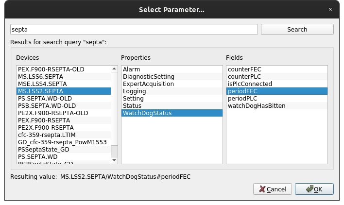
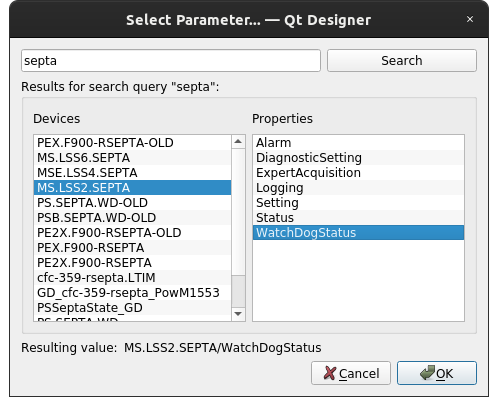
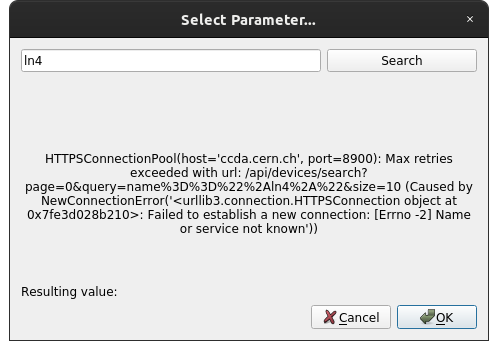
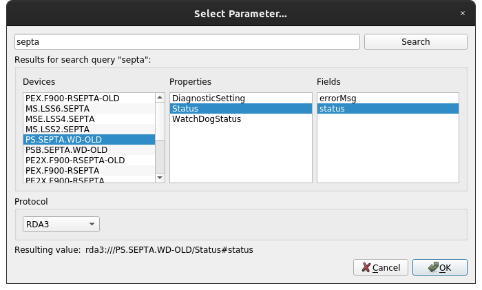

.. rst_epilog sometimes fails, so we need to include this explicitly, for colors
.. include:: <s5defs.txt>
.. include:: ../../extra-s5defs.txt

Parameter selector
==================

.. note:: To start using this widget, make sure to specify ``parameter_selector`` as an extra, when installing
          accwidgets, or use ``all-widgets``. More on :ref:`install:Specifying dependencies`.

This component provides a dialog to select a parameter name (``device/property`` or ``device/property#field``)
from CCDB. This dialog is accessible via multiple ways and helper widgets.

- `Asynchronous operation`_
- `Ordering`_
- `Errors`_
- `Helper widgets`_
- `Support for protocols`_
- `Alternative CCDB environments`_
- `Further read`_

Regardless of whether you search for a device name, or input other formats, such as "device/property" or
"device/property#field", the dialog will contact CCDB looking for a respective device.

.. note:: When ``enable_fields`` is set to :obj:`False`, ``#field`` component will be stripped from the search
          request (see :ref:`widgets/parameter_selector/examples:No fields example`).

   ParameterSelectorDialog with field selection disabled

Asynchronous operation
----------------------

While in some cases search query can be unique or result in a handful devices, other search queries have a potential
of tasking CCDB to return hundreds or thousands of devices. For instance, a search query "LN4" will result in a long
list returned.

To optimize user experience and not load CCDB, the requests will be performed in chunks, loading information about
5 devices at a time. As user keeps scrolling "Devices" list down, new chunks will be loaded dynamically. Loading
new devices will not interrupt the UI, and you can keep navigating through already loaded devices, as it loads new ones
in the background.

When the dialog is closed, any active CCDB requests will be aborted.

Ordering
--------

.. note:: The dialog provides no guarantee of the order of devices, as it is up to CCDB API to choose a way of
          returning paginated results.

However, dialog will sort properties and fields alphabetically, as those are available upfront and do not require
network requests.

Errors
------

Because the dialog is relying on connection to CCDB, it is susceptible to connection problems. When the network request
error happens, the widget will display the information in the results area.

   Connection error in the parameter selector

Helper widgets
--------------

The dialog can be used directly, as any :class:`QDialog` subclass,
using :meth:`~accwidgets.parameter_selector.ParameterSelectorDialog.exec_`, as shown in
:ref:`widgets/parameter_selector/examples:Bare dialog example`. However, there's also couple of convenience widgets
that can be placed directly into the UI and will handle opening of the dialog:

- :class:`~accwidgets.parameter_selector.ParameterLineEdit` acts more like a :class:`QLineEdit`, where user can
  input parameter name either by hand, or select it form the dialog accessible from a side button. In this widget,
  the selected value can be retrieved from the :attr:`~accwidgets.parameter_selector.ParameterLineEdit.value`
  property or by attaching to :attr:`~accwidgets.parameter_selector.ParameterLineEdit.valueChanged` signal. This
  widget is also available in Qt Designer, while :class:`~accwidgets.parameter_selector.ParameterSelectorDialog`
  is not (for obvious reasons). You can learn more about this widget by looking at the :doc:`examples`.
- :class:`~accwidgets.parameter_selector.ParameterLineEditColumnDelegate` is a convenience implementation that
  allows using :class:`~accwidgets.parameter_selector.ParameterLineEdit` inside tables. Learn about its usage in
  the :ref:`widgets/parameter_selector/examples:Table view example`.

.. seealso:: :ref:`widgets/parameter_selector/examples:Bare dialog example` and
             :ref:`widgets/parameter_selector/examples:Table view example`

Support for protocols
---------------------

The dialog understands the following parameter name notations (and hence is able to extract device name to request
CCDB):

.. code-block::
   :linenos:

   device/property
   device/property#field
   protocol:///device/property
   protocol:///device/property#field
   protocol://service/device/property
   protocol://service/device/property#field

While ``service`` is not used in any way in widget's workflows, it can optionally work with protocols. When passed a
constructor argument, the dialog will display an additional combobox that allows selecting between predefined set
of protocols: ``rda3://``, ``rda://``, ``tgm://``, ``rmi://``, ``no://``, or no protocol at all.

   Parameter selector dialog with protocols enabled

:class:`~accwidgets.parameter_selector.ParameterLineEdit` enables that option via
:attr:`~accwidgets.parameter_selector.ParameterLineEdit.enableProtocols` property, while
:class:`~accwidgets.parameter_selector.ParameterLineEditColumnDelegate` has an optional initializer argument.

If alternative combobox title for "do not use any protocol" is desired, class property
:attr:`ParameterSelectorDialog.no_protocol_option <accwidgets.parameter_selector.ParameterSelectorDialog.no_protocol_option>`
can be substituted.

When protocol is chosen, it will be integrated in the resulting value. And since ``service`` is always omitted, you
will end up with either ``protocol:///device/property`` format, or ``protocol:///device/property#field``.

.. seealso:: :ref:`widgets/parameter_selector/examples:Protocols example`

Alternative CCDB environments
-----------------------------

.. include:: ../_pyccda_config.rst

Further read
------------

.. toctree::
   :maxdepth: 1

   examples
   api/modules
