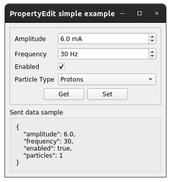

Examples
==========

This page briefly explains the examples, that can be found in ``examples/property_edit`` directory of the project's
`source code <https://gitlab.cern.ch/acc-co/accsoft/gui/accsoft-gui-pyqt-widgets>`__.

- `Programmatic example`_
- `Qt Designer example`_
- `Custom layout example`_
- `Custom widget example`_

Programmatic example
--------------------

To launch this example from the project root, run:

.. code-block:: bash

   python examples/property_edit/amplitude_example.py

This example embeds a single :class:`~accwidgets.property_edit.PropertyEdit` widget, which contains 4 fields of
different types. Both "Get" and "Set" buttons are available. Whenever user presses "Set", the assumed propagation
of the value to the control system is reflected by JSON representation in the bottom of the window. "Get" will
reset the field values to the predefined setting.

.. container:: collapsible-block

   .. container:: collapsible-title

      .. raw:: html

         Show contents of amplitude_example.py...

   .. literalinclude:: ../../../examples/property_edit/amplitude_example.py

.. raw:: html

   

Qt Designer example
-------------------

To launch this example from the project root, run:

.. code-block:: bash

   python examples/property_edit/designer_example.py

Example of embedding :class:`~accwidgets.property_edit.PropertyEdit` widget using Qt Designer. UI loaded from the
``designer_example.ui`` file. 2 :class:`~accwidgets.property_edit.PropertyEdit` widgets work on the same data set.
First one, with the "Set" button, lets you define custom values. Pressing "Set", propagates the value to the assumed
control system, reflected by the JSON representation in the bottom of the window. The second widget, with the "Get"
button, lets you fetch updated values from the control system, so it starts displaying same values as seen in the JSON
representation.

.. container:: collapsible-block

   .. container:: collapsible-title

      .. raw:: html

         Show contents of designer_example.py...

   .. literalinclude:: ../../../examples/property_edit/designer_example.py

.. raw:: html

   

Custom layout example
---------------------

To launch this example from the project root, run:

.. code-block:: bash

   python examples/property_edit/custom_layout_example.py

This example embeds a single :class:`~accwidgets.property_edit.PropertyEdit` widget, which contains 2 fields of
different types. The purpose is to show how to layout inner widgets differently from the standard **Form** layout.
The rest of the setup if similar to `Programmatic example`_.

.. container:: collapsible-block

   .. container:: collapsible-title

      .. raw:: html

         Show contents of custom_layout_example.py...

   .. literalinclude:: ../../../examples/property_edit/custom_layout_example.py

.. raw:: html

   

Custom widget example
---------------------

To launch this example from the project root, run:

.. code-block:: bash

   python examples/property_edit/custom_widget_example.py

This example embeds a single :class:`~accwidgets.property_edit.PropertyEdit` widget, which contains 2 fields of
different types. The purpose is to show how to create a custom inner widget, as opposed to default form field
widget.

.. container:: collapsible-block

   .. container:: collapsible-title

      .. raw:: html

         Show contents of custom_widget_example.py...

   .. literalinclude:: ../../../examples/property_edit/custom_widget_example.py

.. raw:: html

   

