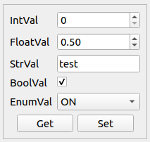
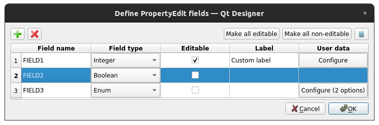
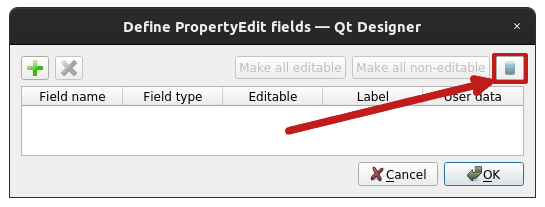
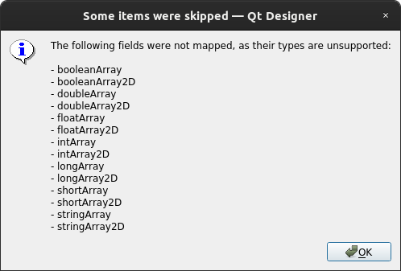

PropertyEdit
============

- `Custom layout`_
- `Configuration in Qt Designer`_

  * `Integration with CCDB`_

- `Further read`_

.. note:: To start using this widget, make sure to specify ``property_edit`` as an extra, when installing
          accwidgets, or use ``all-widgets``. More on :ref:`install:Specifying dependencies`.

:class:`~accwidgets.property_edit.PropertyEdit` allows interacting with multiple fields of the same property
(as a concept of CERN's device properties), similar to the "Knob" of a
`WorkingSet <https://wikis.cern.ch/display/CTF3OP/WorkingSet>`__. Its main advantage is that it allows writing (or
getting) multiple fields in an atomic way with a single button click.

The widget can display "Get" or "Set" buttons (or both) based on configuration
:attr:`~accwidgets.property_edit.PropertyEdit.buttons`. These buttons trigger corresponding slots:
:attr:`~accwidgets.property_edit.PropertyEdit.valueRequested` and
:attr:`~accwidgets.property_edit.PropertyEdit.valueUpdated`. When no explicit "Get" button is displayed, it can still
receive subscription data via :meth:`~accwidgets.property_edit.PropertyEdit.setValue` slot.

.. note:: This widget only displays data. Communication with the control system has to be done by the user.

Custom layout
-------------

By default this component will layout widgets in a form, picking the best matching widget for each of the field types.
However, it is possible to customize both layout and rendered widgets via the delegate system
(:attr:`~accwidgets.property_edit.PropertyEdit.layout_delegate` and
:attr:`~accwidgets.property_edit.PropertyEdit.widget_delegate` respectively). If you are sticking with default "form"
layout, it is possible to modify its margins and alignment properties exposed on
:class:`~accwidgets.property_edit.PropertyEdit` widget directly, e.g.
:attr:`~accwidgets.property_edit.PropertyEdit.formRowWrapPolicy`,
:attr:`~accwidgets.property_edit.PropertyEdit.formLabelAlignment`, etc.

Configuration in Qt Designer
----------------------------

When adding the widget in Qt Designer it is possible to configure its property composition via UI. For that, right
click on the widget to open the context menu and select "Edit Contents..."

   Example of Qt Designer dialog to edit PropertyEdit contents

Here it is possible to configure fields that should be displayed in the widget. "User data" column is dynamically
reconfigured per field type to allow specific additional configuration. For instance:

- Enum types can have their options defined via additional dialog
- Numerical types allow min/max values and unit label configuration
- Floating point types allow setting precision

.. note:: While "unit" is available for numerical types, there's currently no support for "unit exponent", therefore
          pay attention when configuring for property fields that contain both in CCDB, since unit displayed without
          exponent can confuse end users, or set custom unit value. E.g.

          - unit = "s", "unit exponent" = "-3" → represent as "ms"
          - unit = "s", "unit exponent" = "2" → represent as "s^2"

Integration with CCDB
^^^^^^^^^^^^^^^^^^^^^

It is possible to configure the widget by reading information from CCDB. For the sake of not imposing additional runtime
overhead and delays this operation is only available at the design time in Qt Designer.

   Button for CCDB-assisted configuration

.. note:: This functionality relies on :doc:`../parameter_selector/index` module of the `accwidgets` library. If this
          module fails to load (e.g. due to insufficient dependencies, if it was not listed in the extras during
          installation (see :ref:`install:Specifying dependencies`) the Qt Designer dialog will not display CCDB
          button, while still allowing manual configuration.

Once CCDB device property is selected, its contents will be retrieved and converted to be presented in the table.
Since the widget does not support complex field types, such as arrays, functions and function lists, these fields
will be excluded. User is notified if some fields have been excluded during the conversion.

   Notification about skipped fields

Alongside main field properties metadata, such as min/max values and units, enum options, is converted.

.. note:: Precision for floating point types remains always manual due to the absence of this information in CCDB.

Further read
------------

.. toctree::
   :maxdepth: 1

   examples
   api/modules
