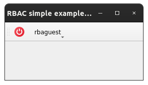
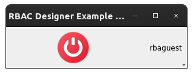
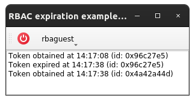
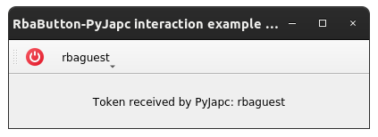
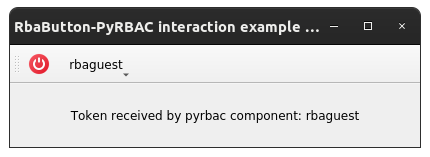
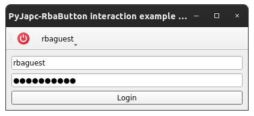
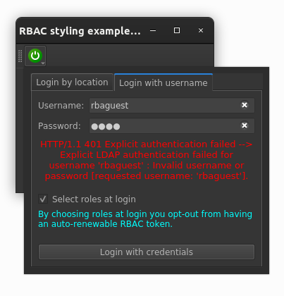
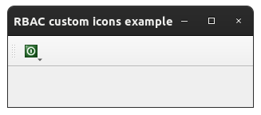

Examples
==========

This page briefly explains the examples, that can be found in ``examples/rbac`` directory of the project's
`source code <https://gitlab.cern.ch/acc-co/accsoft/gui/accsoft-gui-pyqt-widgets>`__. To ensure presence of additional
packages needed to run examples, it is advised to install a special ``examples`` category:

.. code-block:: bash

   pip install .[examples]

- `Basic example`_
- `Qt Designer example`_
- `Expiration example`_
- `PyJapc example`_
- `PyRBAC example`_
- `External token example`_
- `QSS styling example`_
- `Custom icons example`_

Basic example
-------------

To launch this example from the project root, run:

.. code-block:: bash

   python examples/rbac/basic_example.py

This example shows the simplest way of using :class:`~accwidgets.rbac.RbaButton` widget. The only thing that it does,
is print token information to the console when login has succeeded.

.. container:: collapsible-block

   .. container:: collapsible-title

      .. raw:: html

         Show contents of basic_example.py...

   .. literalinclude:: ../../../examples/rbac/basic_example.py

.. raw:: html

   

Qt Designer example
-------------------

To launch this example from the project root, run:

.. code-block:: bash

   python examples/rbac/designer_example.py

This is an example integrating :class:`~accwidgets.rbac.RbaButton`, produced using Qt Designer, instead of the
programmatically created one. Because Qt Designer does not allow placing widgets into toolbars, it can only be added to
the main widget. When required to use inside :class:`QToolBar`, consider creating
:class:`~accwidgets.rbac.RbaButton` programmatically.

.. container:: collapsible-block

   .. container:: collapsible-title

      .. raw:: html

         Show contents of designer_example.py...

   .. literalinclude:: ../../../examples/rbac/designer_example.py

.. raw:: html

   

Expiration example
------------------

To launch this example from the project root, run:

.. code-block:: bash

   python examples/rbac/expiration_example.py

This example shows how token expiration can be handled, when using :class:`~accwidgets.rbac.RbaButton` widget.
:class:`~accwidgets.rbac.RbaButton` will automatically renew tokens when they expire, but only if user roles
have not been specifically configured. Custom user roles produce non-renewable tokens. This example logs the
events of login/logout/token expiration. It also configures RBAC behavior to generate tokens with lifetime
of 1 minute, the shortest possible time frame. Try different ways of logging in and observe the logged messages
in the main window.

.. container:: collapsible-block

   .. container:: collapsible-title

      .. raw:: html

         Show contents of expiration_example.py...

   .. literalinclude:: ../../../examples/rbac/expiration_example.py

.. raw:: html

   

PyJapc example
--------------

To launch this example from the project root, run:

.. code-block:: bash

   python examples/rbac/pyjapc_example.py

This example shows the way of using :class:`~accwidgets.rbac.RbaButton` widget with Java RBAC implementation,
taking :class:`~pyjapc.PyJapc` as a use-case. :class:`~pyjapc.PyJapc` is backed by Java libraries, including
RBAC components, while :mod:`pyrbac` under the hood of :class:`~accwidgets.rbac.RbaButton` relies on C++ implementation
of RBAC. Hence, the token is not automatically synchronized between the two environments, and user glue code is
needed to propagate the token. :class:`~accwidgets.rbac.RbaButton` fires a signal, when a token gets created.
This token is of :class:`pyrbac.Token` type, but it can be serialized into a :obj:`bytes` array and recreated in Java,
using Java methods from ``cern.rbac`` package. This example displays a label with the token information,
that is retrieved via :class:`~pyjapc.PyJapc`'s calls, to prove that the token is correctly recreated in Java.

.. container:: collapsible-block

   .. container:: collapsible-title

      .. raw:: html

         Show contents of pyjapc_example.py...

   .. literalinclude:: ../../../examples/rbac/pyjapc_example.py

.. raw:: html

   

PyRBAC example
--------------

To launch this example from the project root, run:

.. code-block:: bash

   python examples/rbac/pyrbac_example.py

This example shows the way of using :class:`~accwidgets.rbac.RbaButton` widget with other :mod:`pyrbac`-reliant
components. In this example, ``ThirdPartyRbacComponent`` acts as a class that in reality could be coming from some
other library. What's important, it can work with :mod:`pyrbac` objects directly. To simulate its operation,
it simply extracts the user name from the RBAC token and fires it in a signal, to be displayed by the GUI.
:mod:`pyrbac` does not keep tokens in a global state, therefore even though both components are using :mod:`pyrbac`,
token propagation is still needed to synchronize the states.

.. container:: collapsible-block

   .. container:: collapsible-title

      .. raw:: html

         Show contents of pyrbac_example.py...

   .. literalinclude:: ../../../examples/rbac/pyrbac_example.py

.. raw:: html

   

External token example
----------------------

To launch this example from the project root, run:

.. code-block:: bash

   python examples/rbac/external_auth_example.py

This example shows how authentication performed outside of :class:`~accwidgets.rbac.RbaButton` can be propagated
into the widget to display the relevant status and information. Here we are using
:meth:`PyJapc.rbacLogin <pyjapc.PyJapc.rbacLogin>` method to authenticate (which calls into Java libraries under the
hood of :class:`~pyjapc.PyJapc`), and send a serialized token to the widget, to be recreated as :mod:`pyrbac`
C++ token inside. The same technique can be used with other authentication methods or libraries, as long as they
can produce one of the accepted token types: :class:`pyrbac.Token` object, encoded :obj:`bytes` array, or
base64-serialized string. Use the UI in the main window to login, and observe how :class:`~accwidgets.rbac.RbaButton`
adapts to the new token.

.. container:: collapsible-block

   .. container:: collapsible-title

      .. raw:: html

         Show contents of external_auth_example.py...

   .. literalinclude:: ../../../examples/rbac/external_auth_example.py

.. raw:: html

   

QSS styling example
-------------------

To launch this example from the project root, run:

.. code-block:: bash

   python examples/rbac/styling_example.py

This is the example of stylizing the widget with custom colors when QSS is not involved. We are presenting the color
scheme that could be used in the dark mode style.

.. container:: collapsible-block

   .. container:: collapsible-title

      .. raw:: html

         Show contents of styling_example.py...

   .. literalinclude:: ../../../examples/rbac/styling_example.py

.. raw:: html

   

Custom icons example
--------------------

To launch this example from the project root, run:

.. code-block:: bash

   python examples/rbac/custom_icons_example.py

This example shows the way of setting custom icons in a :class:`~accwidgets.rbac.RbaButton` widget.
The rest of the logic is identical to `Basic example`_.

.. container:: collapsible-block

   .. container:: collapsible-title

      .. raw:: html

         Show contents of custom_icons_example.py...

   .. literalinclude:: ../../../examples/rbac/custom_icons_example.py

.. raw:: html

   

