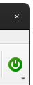
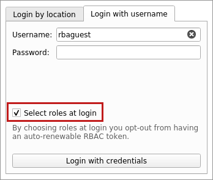
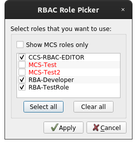
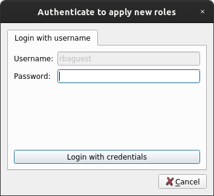
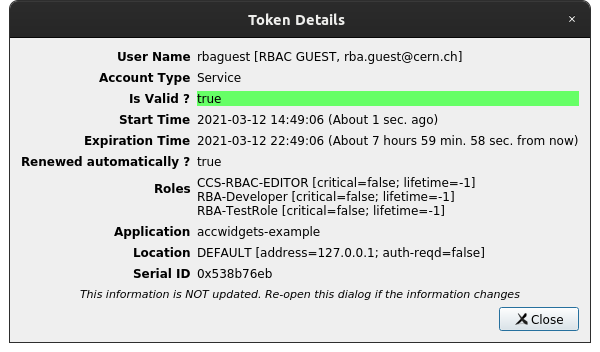
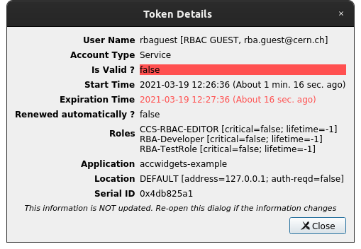

.. rst_epilog sometimes fails, so we need to include this explicitly, for colors
.. include:: <s5defs.txt>
.. include:: ../../extra-s5defs.txt

RBAC
====

.. note:: To start using this widget, make sure to specify ``rbac`` as an extra, when installing
          accwidgets, or use ``all-widgets``. More on :ref:`install:Specifying dependencies`.

:class:`~accwidgets.rbac.RbaButton` handles user authentication and displays information from RBAC token. It can be
used separately, or as a part of :doc:`../app_frame/index`.

- `Authentication`_

  * `Authentication in UI`_
  * `Authentication during startup`_
  * `Authentication outside of the component`_

- `Authorization`_

  * `User roles`_

- `RBAC Token`_
- `Environment`_

  * `Public key`_
  * `Application name`_

- `Known limitations`_

.. image:: ../../img/rbac_loggedin.png

:class:`~accwidgets.rbac.RbaButton` can be placed anywhere, but is best fit for usage in :class:`QToolBar`. When
accommodated inside :class:`QToolBar`, it automatically starts tracking toolbar's icon size and orientation,
to fit the look. Outside of :class:`QToolBar` widget will adjust the icon size to fit the available area.

Widget is available as Qt Designer plugin, but due to Qt Designer's limitations widgets can't be placed into
:class:`QToolBar`. Therefore, :class:`~accwidgets.rbac.RbaButton` needs to be added to :class:`QToolBar`
programmatically.

Authentication
--------------

Currently the following means of authentication are supported:

- By location
- With username and password

.. note:: Kerberos is not supported, as it is not available in :mod:`pyrbac`.

Authentication in UI
^^^^^^^^^^^^^^^^^^^^

User authentication status gets reflected by the button item:

=========================  ======================
**User is authenticated**  **User is logged out**
-------------------------  ----------------------
|loggedin|                 |loggedout|
=========================  ======================

.. |loggedin| image:: ../../img/rbac_loggedin.png

When authenticating, by default all available non-critical (non-MCS) roles will be assigned to the user. You can opt-in
to alter the roles during login, or change it afterwards via a dialog, as explained in `User roles`_. To alter roles
at login, tick the checkbox "Select roles at login".

   Example of the login popup offering role selection

It will interactively ask to select roles using the dialog similar to :ref:`role_picker` before
finishing the authentication sequence.

.. note:: By default, tokens are automatically renewed before they expire. However, when selecting specific roles,
          auto-renewal feature is disabled. This also applies to cases when initially auto-renewable token was received,
          but then another token was generated by selecting roles, as explained in `User roles`_.

Authentication during startup
^^^^^^^^^^^^^^^^^^^^^^^^^^^^^

:class:`~accwidgets.rbac.RbaButton` makes no assumptions about startup policies and **does not** attempt to perform
authentication. However, user code can produce this behavior, if required:

- If automatic login by location is desired, call
  :meth:`.model.login_by_location() <accwidgets.rbac.RbaButtonModel.login_by_location>` as soon as the component is
  created.
- If authentication is done outside of the target application (e.g. in
  `CCM <https://wikis.cern.ch/display/CCM/CCM+Home>`__), the serialized token can be passed via command line arguments
  to the application, which can then integrate it into :class:`~accwidgets.rbac.RbaButton` using
  :meth:`~accwidgets.rbac.RbaButtonModel.update_token` call.

Authentication outside of the component
^^^^^^^^^^^^^^^^^^^^^^^^^^^^^^^^^^^^^^^

When authentication is performed outside of the widget, the new token can be passed to the widget (using
:meth:`~accwidgets.rbac.RbaButtonModel.update_token`), to synchronize the state. This allows performing
authentication using Java RBAC libraries, or even other components, relying on :mod:`pyrbac`.

.. note:: :mod:`pyrbac` does not keep tokens in a global state, therefore even though both components are using
          :mod:`pyrbac`, token propagation is still needed to synchronize the states.

:meth:`~accwidgets.rbac.RbaButtonModel.update_token` can be called directly, or used as a PyQt slot. It can accept
either :class:`pyrbac.Token` object directly, the encoded :obj:`bytes` array, which will be used to recreate the
token, or base64-serialized string of the encoded :obj:`bytes` array.

.. seealso:: :ref:`widgets/rbac/examples:External token example`

Authorization
-------------

Authorization refers to permissions for certain actions of an authenticated user. Normally, RBAC permissions for
concrete actions are configured on the FESA/LSA side. User may configure roles that will present a different set
of permissions within a scope of given authenticated session.

User roles
^^^^^^^^^^

During authentication, user receives a default set of non-critical roles. These can be changed by clicking on the
username inside the widget, and selecting menu "Select Roles".

Presented dialog displays all available roles, including critical roles
(`MCS - "Management of Critical Settings" <https://wikis.cern.ch/display/LSA/MCS>`__) that are colored in red (or
otherwise configurable by :attr:`~accwidgets.rbac.RbaButton.mcsColor`).

.. _role_picker:

   Example of the RBAC role picker dialog

Changing roles will require to authenticate again in order to receive a new RBAC token with selected roles. In case of
initial login by location, token will be renewed automatically by issuing another request by location. If user has
initially authenticated with username and password, password confirmation will be required in the pop-up dialog. If
token was created externally, and login method is not known, all login options will be available.

   Example of password confirmation after changing RBAC roles

RBAC Token
----------

RBAC token can be reviewed for an authenticated user by clicking on the username inside the widget, and selecting
menu "Show Existing RBAC Token".

It presents all relevant information similarly to Java applications, omitting some parts that are specific to Java APIs,
e.g. "Context".

.. _token_dialog:

   Example of the Token details dialog

   Example of the expired Token details

Environment
-----------

This configuration is not related to the widget itself, but rather how :mod:`pyrbac` can be configured for a given
application. Please refer to
`its documentation <https://acc-py.web.cern.ch/gitlab-mono/acc-co/cmw/cmw-core/docs/pyrbac/master/>`__ for complete
details about the configuration.

.. note:: While Java RBAC library can be configured using JVM properties at startup, it is highly suggested to use
          environment variables similar to :mod:`pyrbac`'s. In this way, you can be certain that configuration stays
          the same between the 2 implementations and won't be confused when moving RBAC tokens around. For instance,
          ``RBAC_ENV`` defines which RBAC server should be contacted and which public key should be used. It can be
          very confusing if different implementations would use different servers inside the same process. All JVM
          properties can be configured as environment variables by changing the name to the caps and replacing dots
          with underscores, e.g. ``rbac.env`` = ``RBAC_ENV``.

Public key
^^^^^^^^^^

:mod:`pyrbac` will locate and verify a public key on its first usage (e.g. when user tries to login for the first time).
By default, this key is bundled withing :mod:`pyrbac` itself, but the custom key can be provided by defining
``RBAC_PKEY`` environment variable, e.g.

.. code-block:: bash

   export RBAC_PKEY=/user/rbac/pkey/rba-pub.txt

Application name
^^^^^^^^^^^^^^^^

When contacting RBAC servers, the library provides the information about the client. By default, :mod:`pyrbac` will
set the application name to executable name, e.g. ``python``. This can be changed by defining ``RBAC_APPLICATION_NAME``
variable. The application name is reflected in the authenticated token and can be found in
:ref:`token details dialog <token_dialog>`.

Known limitations
-----------------

#. Widget can't be placed inside toolbar in Qt Designer, due to Qt Designer's
   `limitations <https://stackoverflow.com/a/7370030>`__, which do not allow widget-based :class:`QAction` placement.
#. Kerberos is not supported, due to missing support in :mod:`pyrbac`.
#. Changing roles for an authenticated user is not possible when RBAC token was created externally,
   or roles selection was skipped during login, due to API limitations in :mod:`pyrbac`.
#. When changing roles for an authenticated user, it is not possible to create a new token without requiring to
   authenticate again.
#. Service to automatically renew expiring tokens cannot be used when token is created with custom roles, due to
   API limitations in :mod:`pyrbac`.
#. Token must be explicitly passed between :class:`~accwidgets.rbac.RbaButton` and other 3rd-party components, because
   underlying system is not global and cannot synchronize all the RBAC subsystems in the application.
#. JVM properties should not be used for RBAC configuration, as it is more error-prone approach, when using Java and
   :mod:`pyrbac` in the same project. Environment variables, on the other hand, do configure both implementations in a
   consistent way.

Further read
------------

.. toctree::
   :maxdepth: 1

   examples
   api/modules
