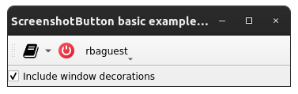
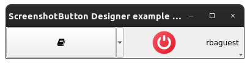
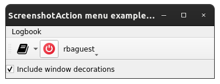
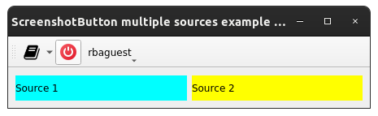
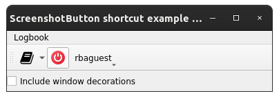
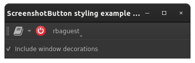

Examples
==========

This page briefly explains the examples, that can be found in ``examples/screenshot`` directory of the project's
`source code <https://gitlab.cern.ch/acc-co/accsoft/gui/accsoft-gui-pyqt-widgets>`__. To ensure presence of additional
packages needed to run examples, it is advised to install a special ``examples`` category:

.. code-block:: bash

   pip install .[examples]

- `Basic example`_
- `Qt Designer example`_
- `Action example`_
- `Custom sources example`_
- `Shortcut example`_
- `QSS styling example`_

Basic example
-------------

To launch this example from the project root, run:

.. code-block:: bash

   python examples/screenshot/basic_example.py

This example shows the simplest way of using :class:`~accwidgets.screenshot.ScreenshotButton` widget. When no sources
are specified, the button will grab a screenshot of the parent window. We can control the appearance of the window
screenshot with :attr:`~accwidgets.screenshot.ScreenshotButton.includeWindowDecorations` property. For the sake of
example, we are using custom model that does connect to the ``TEST`` e-logbook server.

.. container:: collapsible-block

   .. container:: collapsible-title

      .. raw:: html

         Show contents of basic_example.py...

   .. literalinclude:: ../../../examples/screenshot/basic_example.py

.. raw:: html

   

Qt Designer example
-------------------

To launch this example from the project root, run:

.. code-block:: bash

   python examples/screenshot/designer_example.py

This is an example integrating :class:`~accwidgets.screenshot.ScreenshotButton`, produced using Qt Designer,
instead of the programmatically created one. Because Qt Designer does not allow placing widgets into toolbars,
it can only be added to the main widget. When required to use inside :class:`QToolBar`, consider creating
:class:`~accwidgets.screenshot.ScreenshotButton` programmatically. For the sake of example, we are using custom
model that does connect to the ``TEST`` e-logbook server.

.. container:: collapsible-block

   .. container:: collapsible-title

      .. raw:: html

         Show contents of designer_example.py...

   .. literalinclude:: ../../../examples/screenshot/designer_example.py

.. raw:: html

   

Action example
--------------

To launch this example from the project root, run:

.. code-block:: bash

   python examples/screenshot/action_example.py

This example shows the simplest way of using :class:`~accwidgets.screenshot.ScreenshotAction` for integrating into
user-defined button or menu without the need of using dedicated :class:`~accwidgets.screenshot.ScreenshotButton`
widget. This action has the same logic, and it is what actually drives :class:`~accwidgets.screenshot.ScreenshotButton`
under the hood, defining its enabled/disabled state, tooltips and other properties. In this example, we are reusing
the same action for the toolbar button and the menu. For the sake of example, we are using custom model that does
connect to the ``TEST`` e-logbook server.

.. container:: collapsible-block

   .. container:: collapsible-title

      .. raw:: html

         Show contents of action_example.py...

   .. literalinclude:: ../../../examples/screenshot/action_example.py

.. raw:: html

   

Custom sources example
----------------------

To launch this example from the project root, run:

.. code-block:: bash

   python examples/screenshot/custom_sources_example.py

This example shows the way of using :class:`~accwidgets.screenshot.ScreenshotButton` widget with multiple sources.
These sources should not necessarily be windows, it can be individual subwidgets, which are represented here by
2 separate labels, colored in cyan and yellow. For the sake of example, we are using custom model that does connect
to the ``TEST`` e-logbook server.

.. container:: collapsible-block

   .. container:: collapsible-title

      .. raw:: html

         Show contents of custom_sources_example.py...

   .. literalinclude:: ../../../examples/screenshot/custom_sources_example.py

.. raw:: html

   

Shortcut example
----------------

To launch this example from the project root, run:

.. code-block:: bash

   python examples/screenshot/shortcut_example.py

This example shows the way of assigning a key sequence as a shortcut for triggering the action without necessarily
pushing the button. It can be done with a standalone :class:`~accwidgets.screenshot.ScreenshotAction` or the one
that belongs to the :class:`~accwidgets.screenshot.ScreenshotButton`. For the sake of example, we are using custom
model that does connect to the ``TEST`` e-logbook server.

.. container:: collapsible-block

   .. container:: collapsible-title

      .. raw:: html

         Show contents of shortcut_example.py...

   .. literalinclude:: ../../../examples/screenshot/shortcut_example.py

.. raw:: html

   

QSS styling example
-------------------

To launch this example from the project root, run:

.. code-block:: bash

   python examples/screenshot/styling_example.py

This is the example of stylizing the widget with custom colors using QSS. We are presenting the color
scheme that could be used in the dark mode style. The widget is reused from the `Basic example`_.

.. container:: collapsible-block

   .. container:: collapsible-title

      .. raw:: html

         Show contents of styling_example.py...

   .. literalinclude:: ../../../examples/screenshot/styling_example.py

.. raw:: html

   

