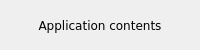

.. rst_epilog sometimes fails, so we need to include this explicitly, for colors
.. include:: <s5defs.txt>
.. include:: ../../extra-s5defs.txt

Screenshot (e-Logbook) button
=============================

.. note:: To start using this widget, make sure to specify ``screenshot`` as an extra, when installing
          accwidgets, or use ``all-widgets``. More on :ref:`install:Specifying dependencies`.

:class:`~accwidgets.screenshot.ScreenshotButton` allows taking the screenshot of application window or its
sub-component and send it to the e-logbook. It can be used separately, or as a part of :doc:`../app_frame/index`.

- `Screenshot action`_
- `e-Logbook communication`_

  * `Errors`_

- `RBAC authentication`_

  * `Within ApplicationFrame`_

- `Custom screenshot sources`_

.. image:: ../../img/screenshot.png

This widget allows creating a new e-logbook entry with attached screenshot(s) by simply clicking the button, or
selecting "Create new entry" from the menu. Menu will asynchronously load a configurable number of existing e-logbook
entries (10 by default, see :attr:`~accwidgets.screenshot.ScreenshotButton.maxMenuEntries`) from the configurable
number of recent days (1 by default, see :attr:`~accwidgets.screenshot.ScreenshotButton.maxMenuDays`). Clicking on any
of these items will attach a screenshot to the given e-logbook entry. Each of the items has an associated tooltip with
more information that can be issued by hovering over the item with the mouse.

   Tooltip when hovering over a list item

For :class:`~accwidgets.screenshot.ScreenshotButton` to operate properly, it is essential to provide a valid RBAC token
and an existing logbook (activity) name. It can be done either during the initialization:

.. code-block:: python

   from accwidgets.screenshot import LogbookModel, ScreenshotAction, ScreenshotButton
   ...
   model = LogbookModel(rbac_token=my_existing_token,
                        activities="LINAC_4")
   action = ScreenshotAction(model=model)
   button = ScreenshotButton(action=action)

or after the fact by manipulating properties:

.. code-block:: python

   from accwidgets.screenshot import ScreenshotButton
   ...
   button = ScreenshotButton()
   button.model.logbook_activities = "LINAC_4"
   button.model.reset_rbac_token(my_existing_token)

Furthermore, it is possible to connect an existing :class:`~accwidgets.rbac.RbaButton` to this widget, so that RBAC
token propagation and updates are handled automatically (see `RBAC authentication`_).

.. seealso:: `e-Logbook communication`_

:class:`~accwidgets.screenshot.ScreenshotButton` can be placed anywhere, but is best fit for usage in :class:`QToolBar`.
When accommodated inside :class:`QToolBar`, it automatically starts tracking toolbar's icon size and orientation,
to fit the look. Outside of :class:`QToolBar` widget will adjust the icon size to fit the available area.

Widget is available as Qt Designer plugin, but due to Qt Designer's limitations widgets can't be placed into
:class:`QToolBar`. Therefore, :class:`~accwidgets.screenshot.ScreenshotButton` needs to be added to :class:`QToolBar`
programmatically.

Developer can define a message for the new e-logbook entry via :attr:`~accwidgets.screenshot.ScreenshotButton.message`
property. When left empty, user will be offered to enter the message everytime the new entry is created. E-logbook
entry cannot be created without any message. When attaching screenshot(s) to an existing e-logbook entry,
message will not be overwritten.

Besides, it is possible to configure the approach of taking screenshots via
:attr:`~accwidgets.screenshot.ScreenshotButton.includeWindowDecorations` property. When enabled, taking the screenshot
of a window will include the title bar and the window frame (both of which by the window system as part of the
desktop environment, e.g. Gnome, Xfce or other window managers in Linux).

.. table::
   :widths: 1 1

   ====================  =======================
   **With decorations**  **Without decorations**
   |decor|               |nodecor|
   ====================  =======================

.. note:: Including window decorations may have unexpected results in rare cases. While without them widget's or
          window's pixel buffer is rendered directly into a \*.png file, including decorations involves taking a
          screenshot of the area on the screen. In this case, window system elements that overlap the application
          window will be included in the screenshot.

Screenshot action
-----------------

:class:`~accwidgets.screenshot.ScreenshotAction` allows interacting with e-logbook in the same way without necessarily
having to create a button. This is useful in some cases, for example, when there's no toolbar available to accommodate
a button, and the action is placed in a menu instead.

In fact, the :class:`~accwidgets.screenshot.ScreenshotButton` is a simple shell around
:class:`~accwidgets.screenshot.ScreenshotAction`, which contains the main logic and the visual properties.
Button's purpose is to provide convenience accessors to action's properties, while it adapts its look
to the action, like any :class:`QToolButton` fitted with a :class:`QAction` would. It means that any
:class:`~accwidgets.screenshot.ScreenshotButton` can be updated with another instance of
:class:`~accwidgets.screenshot.ScreenshotAction` or its subclass by calling the
:meth:`~accwidgets.screenshot.ScreenshotButton.setDefaultAction` method.

The advantage of :class:`QAction` abstraction is that it can be reused in multiple places. For example, this same
screenshot ability can be achieved by clicking a toolbar button, selecting a menu, or using a shortcut key sequence
(if action was associated with one).

.. seealso:: :ref:`widgets/screenshot/examples:Action example`, :ref:`widgets/screenshot/examples:Shortcut example`

e-Logbook communication
-----------------------

The architecture follows the Qt's `Model/View pattern <https://doc.qt.io/qt-5/model-view-programming.html>`__, which
allows to segregate remote e-Logbook calls in a replaceable object. In this case,
:class:`~accwidgets.screenshot.LogbookModel` represents a model, while :class:`~accwidgets.screenshot.ScreenshotAction`
could be called a view-model, and :class:`~accwidgets.screenshot.ScreenshotButton` - a view.

To work with :mod:`pylogbook`, the model utilizes both higher level :class:`~pylogbook.Client` and activities-specific
:class:`~pylogbook.ActivitiesClient` for various APIs. Therefore, if one was to create a model with user-defined
:mod:`pylogbook` objects, both would need to be passed to the model's initializer.

:class:`~accwidgets.screenshot.LogbookModel` does provide remote calls to e-Logbook in an asynchronous way via
:mod:`asyncio`, and this is harnessed by the action to run the tasks in the background in order to not block the UI. For instance,
loading of existing events into the menu happens in the background (menu loads the events from the server every time
it is shown, due to limitations of :mod:`pylogbook` API, since there's no better way to synchronize the information with
the server). Likewise, when uploading screenshots, only grabbing the actual images happens in the main thread, and
everything else is in the background.

Errors
^^^^^^

As with any remote resource, communication problems can happen.

In case when the list of existing events can't be loaded, "Error occurred" item will be displayed in the menu, and
:attr:`~accwidgets.screenshot.ScreenshotAction.event_fetch_failed` and
:attr:`~accwidgets.screenshot.ScreenshotButton.eventFetchFailed` signals will fire.

If the upload of the screenshot fails (either due to failure of attaching the screenshot to an entry, or failure to
create a new e-logbook entry, or retrieve an existing one) the corresponding signals
:attr:`~accwidgets.screenshot.ScreenshotAction.capture_failed` and
:attr:`~accwidgets.screenshot.ScreenshotButton.captureFailed` will fire.

Lastly, if specified e-Logbook activity does not exist on the server, the action/button will remain disabled, and
the :attr:`~accwidgets.screenshot.ScreenshotButton.activitiesFailed`,
:attr:`ScreenshotAction.activities_failed <accwidgets.screenshot.ScreenshotAction.activities_failed>` and
:attr:`LogbookModel.activities_failed <accwidgets.screenshot.LogbookModel.activities_failed>` signals will fire.

.. note:: The connection to the e-logbook server is attempted only after **both** RBAC token and activity name are
          provided, therefore you will not receive the :attr:`~accwidgets.screenshot.LogbookModel.activities_failed`
          signal when setting one of them to the invalid value, while another one remains empty.

RBAC authentication
-------------------

To operate, e-Logbook requires a valid RBAC token. :class:`~accwidgets.screenshot.LogbookModel` provides means to
supply the token to :mod:`pylogbook` via :meth:`~accwidgets.screenshot.LogbookModel.reset_rbac_token` method, e.g.:

.. code-block:: python

   from accwidgets.screenshot import ScreenshotButton
   ...
   button = ScreenshotButton()
   button.model.reset_rbac_token(my_existing_token)

In addition, there's convenience APIs in both :class:`~accwidgets.screenshot.ScreenshotButton` and
:class:`~accwidgets.screenshot.ScreenshotAction`, namely
:meth:`~accwidgets.screenshot.ScreenshotButton.connect_rbac` and
:meth:`~accwidgets.screenshot.ScreenshotButton.disconnect_rbac`, that will allow to easily connect an existing
:class:`~accwidgets.rbac.RbaButton` to ensure that RBAC tokens are synchronized between two widgets, for instance:

.. code-block:: python

   from accwidgets.rbac import RbaButton
   from accwidgets.screenshot import ScreenshotButton
   ...
   rba_button = RbaButton()
   button = ScreenshotButton()
   button.connect_rbac(rba_button)

Within ApplicationFrame
^^^^^^^^^^^^^^^^^^^^^^^

When used within :class:`~accwidgets.app_frame.ApplicationFrame`, either via
:attr:`~accwidgets.app_frame.ApplicationFrame.useScreenshot` or
:attr:`~accwidgets.app_frame.ApplicationFrame.screenshot_widget`, the screenshot button will automatically integrate
with the :class:`~accwidgets.app_frame.ApplicationFrame`'s RBAC button, provided that RBAC button is also enabled.
This means that providing e-Logbook integration is just few steps away: enable
:attr:`~accwidgets.app_frame.ApplicationFrame.useRBAC` and
:attr:`~accwidgets.app_frame.ApplicationFrame.useScreenshot`, and assign a valid e-Logbook to
:class:`~accwidgets.screenshot.LogbookModel.logbook_activities`, e.g.

.. code-block:: python

   from accwidgets.app_frame import ApplicationFrame
   ...
   window = ApplicationFrame()
   window.useRBAC = True
   window.useScreenshot = True
   window.screenshot_widget.model.logbook_activities = "LINAC_4"

This button will be put in the primary toolbar, on the right-hand side, just before the RBAC button.

.. seealso:: :ref:`ApplicationFrame's Screenshot example <widgets/app_frame/examples:Screenshot example>`

Custom screenshot sources
-------------------------

When source for the screenshot is undefined
(:attr:`ScreenshotAction.source <accwidgets.screenshot.ScreenshotAction.source>`,
:attr:`ScreenshotButton.source <accwidgets.screenshot.ScreenshotButton.source>`), the main window will be captured
in a screenshot.

It is possible to redefine that to any arbitrary widget, which itself can be just a sub-area of a window or another
window.

Furthermore, there can be multiple sources provided as a sequence to these properties. In that case, each of them will
be captured and attached to the same e-logbook event as separate image files. Uploading of the images will be executed
sequentially, one after another.

.. seealso:: :ref:`widgets/screenshot/examples:Custom sources example`

Further read
------------

.. toctree::
   :maxdepth: 1

   examples
   api/modules
