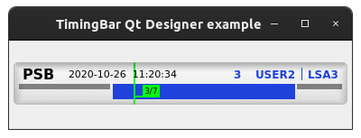

Examples
==========

This page briefly explains the examples, that can be found in ``examples/timing_bar`` directory of the project's
`source code <https://gitlab.cern.ch/acc-co/accsoft/gui/accsoft-gui-pyqt-widgets>`__.

- `Basic example`_
- `Qt Designer example`_
- `Error example`_
- `Palette styling example`_
- `QSS styling examples`_

Basic example
--------------

To launch this example from the project root, run:

.. code-block:: bash

   python examples/timing_bar/basic_example.py

This is the most basic example of using the :class:`~accwidgets.timing_bar.TimingBar` widget. By default, the widget is
initialized with the predefined timing domain. For the sake of example, we are using custom model that does not require
connection to real devices.

.. image:: ../../img/examples_timingbar_basic.png

.. container:: collapsible-block

   .. container:: collapsible-title

      .. raw:: html

         Show contents of basic_example.py...

   .. literalinclude:: ../../../examples/timing_bar/basic_example.py

.. raw:: html

   

Qt Designer example
-------------------

To launch this example from the project root, run:

.. code-block:: bash

   python examples/timing_bar/designer_example.py

This example shows the integration of :class:`~accwidgets.timing_bar.TimingBar` via Qt Designer. The result is
similar to the one produced in `Basic example`_. For the sake of example, we are using custom model that does not
require connection to real devices.

.. container:: collapsible-block

   .. container:: collapsible-title

      .. raw:: html

         Show contents of designer_example.py...

   .. literalinclude:: ../../../examples/timing_bar/designer_example.py

.. raw:: html

   

Error example
-------------

To launch this example from the project root, run:

.. code-block:: bash

   python examples/timing_bar/error_example.py

This is the example of how communication error is displayed to the user in the
:class:`~accwidgets.timing_bar.TimingBar`. The widget will draw a label "Communication error", regardless of the
contents, just to make sure that text will nicely fit in the frame. The actual error information can be received by
hovering mouse cursor over the widget. For the sake of example, we are using custom model that does not require
connection to real devices.

.. container:: collapsible-block

   .. container:: collapsible-title

      .. raw:: html

         Show contents of error_example.py...

   .. literalinclude:: ../../../examples/timing_bar/error_example.py

.. raw:: html

   

Palette styling example
-----------------------

To launch this example from the project root, run:

.. code-block:: bash

   python examples/timing_bar/palette_example.py

This is the example of stylizing the :class:`~accwidgets.timing_bar.TimingBar` with custom colors programmatically.
We are presenting the color scheme that matches the dark mode style. For the sake of example, we are using custom model
that does not require connection to real devices.

.. container:: collapsible-block

   .. container:: collapsible-title

      .. raw:: html

         Show contents of palette_example.py...

   .. literalinclude:: ../../../examples/timing_bar/palette_example.py

.. raw:: html

   

QSS styling examples
--------------------

To launch this example from the project root, run:

.. code-block:: bash

   python examples/timing_bar/qss_example.py

This is the example of stylizing the :class:`~accwidgets.timing_bar.TimingBar` with custom colors using QSS stylesheets.
We are presenting the color scheme that matches the dark mode style. Colors here are similar to the programmatic ones in
`Palette styling example`_. For the sake of example, we are using custom model that does not require connection to
real devices.

.. container:: collapsible-block

   .. container:: collapsible-title

      .. raw:: html

         Show contents of qss_example.py...

   .. literalinclude:: ../../../examples/timing_bar/qss_example.py

.. raw:: html

   

An alternative color scheme for the dark mode is proposed in the following example. To run it:

.. code-block:: bash

   python examples/timing_bar/qss2_example.py

.. container:: collapsible-block

   .. container:: collapsible-title

      .. raw:: html

         Show contents of qss2_example.py...

   .. literalinclude:: ../../../examples/timing_bar/qss2_example.py

.. raw:: html

   

