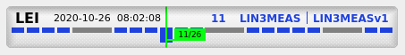
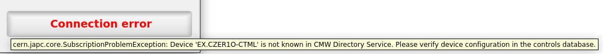

TimingBar
=========

.. note:: To start using this widget, make sure to add ``timing_bar`` as a widget specifier, when installing
          accwidgets, or use ``all-widgets``. More on :ref:`install:Specifying dependencies`.

Timing bar displays the composition of users and currently played user withing a given timing domain.

- `Errors`_
- `Configuration`_
- `Modes`_
- `Model`_

  * `PyJapc`_
  * `Timing updates`_
  * `Timezone`_

- `Styling`_
- `Further read`_

This widget takes advantage of the timing information being exposed via RDA devices
(`XTIM <https://wikis.cern.ch/display/TIMING/XTIM>`__ and CTIM) and subscribes to updates in order to monitor
the events. This is different to conventional Java applications relying on telegram (tgm) libraries. XTIM devices
are emitting timing update events, while CTIM (central timing) devices are queried about the supercycle structure
for certain timing domains.

In order to optimize active RDA connections, the device subscriptions are created lazily - only when the widget appears
on the screen for the first time. This helps avoiding unnecessary connections in cases when the widget object is
created, but is never presented to the user.

Errors
-------

Because the widget is relying on connection to RDA devices, it is susceptible to connection problems. When the error
happens, the widget rendering is switched to the error mode. Here, the label is fixed to "Connection error". However,
the actual error message can be seen in the tooltip, by hovering mouse over the widget.

   Connection error in the timing bar

Because the widget would listen for XTIM updates on ``<domain>.USER.ALL`` cycle selectors, this results in all possible
users being queried during subscription creation. And since only one of them is being played at any given time,
all others will return errors. This effect is only seen on the subscription creation, and is marked by the
``isFirstUpdate`` flag. Hence, all "first update" errors from XTIM devices are ignored and do not result in widget
reporting "Connection error".

Configuration
-------------

The information presented by the widget can be reconfigured in several ways:

#. The heartbeat (advancement of the time) is indicated in the widget by alternating its background color. This can be
   optionally switched off, to reduce distractions (:attr:`~accwidgets.timing_bar.TimingBar.indicateHeartbeat`).
#. The widget is divided into 2 rows: information labels on the top, and the supercycle structure in the lower part.
   Optionally, the lower part can be hidden, leaving only the labels on screen
   (:attr:`~accwidgets.timing_bar.TimingBar.renderSuperCycle`).
#. All labels in the upper part can be hidden or shown (:attr:`~accwidgets.timing_bar.TimingBar.labels`).
#. When displaying timestamp label, the timestamp format can be configured to optionally optionally show the value
   with the second or microsecond precision (:attr:`~accwidgets.timing_bar.TimingBar.showMicroSeconds`), as well as
   display timezone of the timestamps (:attr:`~accwidgets.timing_bar.TimingBar.showTimeZone`). It is also able to
   display timestamps in either local or UTC timezone, based on
   :attr:`~accwidgets.timing_bar.TimingBar.displayedTimeZone` value, regardless of the
   :ref:`timezone used by the model <widgets/timing_bar/index:Timezone>`.
#. Optionally, only certain cycles that correspond to a specific user can be highlighted with a color that is different
   from the rest (:attr:`~accwidgets.timing_bar.TimingBar.highlightedUser`).

Modes
-----

The widget can operate in 2 modes:

#. For timing domains that have a supercycle (e.g. *CPS*, *PSB*, *SPS*, etc), the supercycle diagram reflects this
   structure, respecting the amount and the length of individual cycles.
#. For other timing domains, supercycle does not exist, and thus the diagram will be fixed at showing space of
   128 blocks, each of 1 basic period in length (1.2 seconds). This diagram will not be prefilled with blocks, like
   in supercycle, but will draw the blocks as the time progresses.

.. table::
   :widths: 1 1

   ===================  ======================
   **With supercycle**  **Without supercycle**
   |supercycle|         |nosupercycle|
   ===================  ======================

For the supercycle mode, the CTIM devices are queried about the BCD (Beam Coordination Diagram) structure. Normally,
these diagrams contain a normal supercycle and a spare supercycle (which serves as a backup, in case the normal
supercycle cannot be followed). The widget records both, and displays the one that is actually being played. If the
next XTIM update indicates that the system switched from the normal supercycle to spare, or vice versa, the widget's
supercycle diagram will reflect this change.

Model
-----

:class:`~accwidgets.timing_bar.TimingBar` follows the model-view architecture. In this case, model is responsible for
handling subscriptions to XTIM and CTIM devices, while the view is visualizing the information provided by the model.
Model is not designed to be subclassed, but user can freely create instances of the
:class:`~accwidgets.timing_bar.TimingBarModel` class. When assigning a new model to the widget, the subscriptions
are automatically terminated. The ownership of the model (Qt parent-child relationship) is transferred to the widget.

PyJapc
^^^^^^

Currently, :mod:`pyjapc` is the way to connect to remote devices from Python. This widget takes full advantage of
accwidgets' :ref:`widget-specific dependencies <install:Specifying dependencies>` to not create a hard dependency
on :mod:`pyjapc`, when the widget is not used. Currently, the model makes certain assumptions about PyJapc API
(due to the need to access private APIs) and thus expects a very limited range of compatible PyJapc versions.

Normally, :class:`~accwidgets.timing_bar.TimingBarModel` would create its own :class:`~pyjapc.PyJapc` instance that is
not relying on InCA. However, it is also possible to feed an external :class:`~pyjapc.PyJapc` object into the
constructor. This may be useful for cases, such as a requirement to use :class:`~pyjapc.PyJapc` subclasses, or to have
a :class:`~pyjapc.PyJapc` singleton for the application. It also is a great help in testing scenarios, when a mocked
:class:`~pyjapc.PyJapc` object can be provided.

.. note:: When giving an external :class:`~pyjapc.PyJapc` object, you must be aware of shared subscription storage. For
          instance, :meth:`~pyjapc.PyJapc.stopSubscriptions` and :meth:`~pyjapc.PyJapc.clearSubscriptions` APIs take
          optional parameter name and selector as arguments, affecting every subscription that matches it. Consequently,
          if you happen to provide arguments that match the XTIM and CTIM subscriptions of the
          :class:`~accwidgets.timing_bar.TimingBarModel`, the timing bar widget will malfunction. When no argument is
          given, all subscriptions are affected. On the other hand, :class:`~accwidgets.timing_bar.TimingBarModel`
          does its best to not affect any subscriptions other that the ones it has created (hence the use of private
          APIs).

Timing updates
^^^^^^^^^^^^^^

As explained in `Errors`_, on subscription creation the model will receive updates for all users in the domain.
However, the updates come asynchronously and not necessarily in the right order. To avoid showing false information
until the next XTIM update, the model ignores all updates marked with ``isFirstUpdate`` flag.

In order to show the timestamp of the last timing update, the model will search for timestamps in the following places:

#. Data field ``acqStamp`` from the property of the XTIM device
#. Meta field (header) ``acqStamp`` of the XTIM update
#. Generate current timestamp from Python code, if above fields are not found

Timezone
^^^^^^^^

By default, :class:`~accwidgets.timing_bar.TimingBarModel` instantiates its timestamp objects with the UTC timezone in
mind. This can be overridden by passing the corresponding constructor argument. The timezone is used when creating
local timestamps (e.g. when no ``acqStamp`` field is found in the control system data), as well as constructing the
default :class:`~pyjapc.PyJapc` instance (that will under the hood use it to generate objects from ``acqStamp`` fields).

.. note:: When injecting a `custom PyJapc instance <PyJapc>`_, it is caller's responsibility to ensure that the
          timezone of the :class:`~pyjapc.PyJapc` object corresponds to the timezone communicated to the
          :class:`~accwidgets.timing_bar.TimingBarModel`. Currently, :class:`~pyjapc.PyJapc` does not provide public
          API to read the timezone, therefore the model won't attempt to synchronize them, leaving it up to the user.

Styling
-------

Because of the custom painting for this widget, it comes with custom properties to enable styling so that the widget
can be aligned with the custom look of the application. It is not designed for customizable fonts or sizes, but the
colors can be adjusted.

The styling of the widget can be done in 2 ways: programmatically via
:attr:`~accwidgets.timing_bar.TimingBar.color_palette` property (which tries to mimic :attr:`QWidget.palette` approach),
or via `Qt Style Sheet (QSS) notation <https://doc.qt.io/qt-5/stylesheet-customizing.html>`__ (which is a derivative of
a web standard, called `Cascading Style Sheet (CSS) <https://www.w3schools.com/Css/css_intro.asp>`__).

.. note:: You may find color properties exposed in Qt Designer plugin, however, it has to stay there, because the same
          flag is responsible for showing the properties to Qt Designer and accept customizations through QSS.

Refer to the API (:class:`~accwidgets.timing_bar.TimingBarPalette`) or the :doc:`examples` to see how to restyle the
widget.

Further read
------------

.. toctree::
   :maxdepth: 1

   examples
   api/modules
